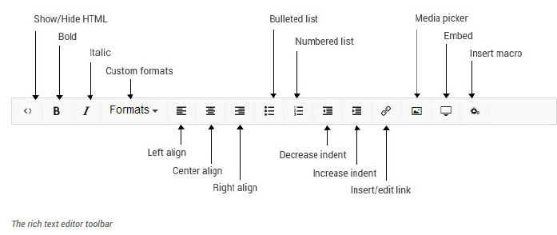
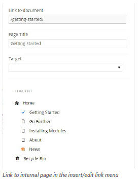
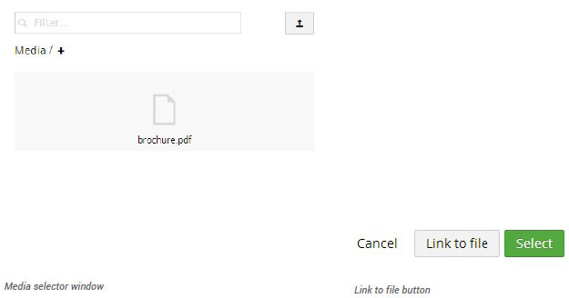
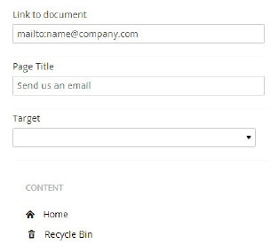
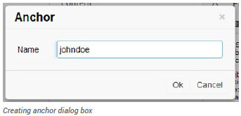
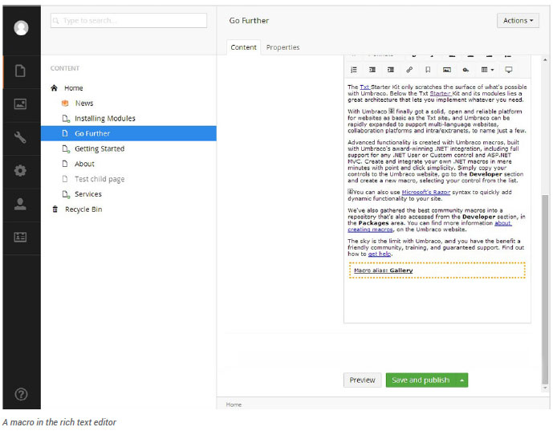

# Rich Text Editor

The Umbraco Rich Text Editor is the field where you, as the editor, can be creative. You select how much you want to do yourself. You can work on text content, format the text, or leave it the way it is. If you want to do more, you can insert images, create tables or create links to other pages or documents.

The functionality varies depending on how the editor is set up. Here we describe the default editor with all options enabled. Contact your system administrator for details regarding your editor.

## Editor Buttons

Below are all the default editor buttons available. Your system administrator is able to determine which buttons are displayed in different templates. You could therefore have access to more or fewer buttons than those shown here.

## Paragraph Break/Line Break

The editor is like any other word processing program. You write the text, and the text wraps around when the line reaches the end. When you press ENTER in the editor, you get a paragraph break, which means there is space between the paragraphs. If you do not want a space, you have to make a line break instead. You do this by pressing SHIFT+ENTER.

## Shortcut Keys

To make your work easier, there are shortcut keys for certain editor functions. Shortcut keys let you use the keyboard to carry out certain commands.

| Shortcut | Action     |
| -------- | ---------- |
| Ctrl + A | Select all |
| Ctrl + B | Bold       |
| Ctrl + C | Copy       |
| Ctrl + I | Italic     |
| Ctrl + U | Underline  |
| Ctrl + V | Paste      |
| Ctrl + X | Cut        |
| Ctrl + Y | Redo       |
| Ctrl + Z | Undo       |

## Text Formatting

You do not normally need to spend much time formatting text because Umbraco takes care of a lot of the formatting for you. When the default formatting is not enough however, there are a number of options for controlling the formatting of text.

### Formatting Buttons

The most basic and probably the most familiar way to control formatting are via the formatting buttons. These work much the same as those found in most word processing applications such as Microsoft Word. With these you can apply basic formatting such as Bold, Italic and underline as well as altering text alignment and creating bulleted and numbered lists.

Regardless of the formatting being applied, the process for applying a format using the formatting buttons is always the same.

1. Select the text you want to apply the formatting to.
2. Click the appropriate format button to apply the formatting you wish to add.

### Formats

Another way of applying formatting is via the Formats drop-down list. The Formats drop-down list provides a set of predefined styles that can be applied to text whilst maintaining a consistent look and feel through the site. These styles often incorporate more advanced formatting functionality which can be applied to provide a different look for certain elements such as links, headings and sub heading. For example you can use a format style to change a link into a call to action button. Whilst the styles available on your site may differ, the process for applying styles is always the same.

1. Select the text you want to apply the style to.
2. Select the style to apply from the Format drop-down list.

### Copying Content from Other Programs

It is important to note that when you pre-write content to later be copied into a rich text editor you may encounter style issues on your website. When pasting content, the original text styles will be preserved which can lead to different font faces, sizes and colours from what is expected when the website is viewed. To prevent this from happening it is advisable that you paste the content into a markdown editor first such as notepad, then copy and paste it from there into your rich text editor.

### Remove Formatting

If you have formatted a paragraph or selection using the formatting buttons, you can remove a formatting rule by selecting the text, and clicking the relevant formatting button to remove that formatting rule. You may also have a remove format button in your toolbar. If you do not have this button please speak to your system administrator.

 _Remove Format button_

## Show/Hide HTML Code

If you are proficient in the use of HTML you can switch to HTML mode and create your page by writing HTML code. You can also check the code and make minor adjustments here to get the page exactly as you want it. Certain elements such as scripts will not be allowed and will be filtered out of code pasted into the rich text editor.

## Links

The _**Insert Link**_ button is used to create links to internal and external pages and media files email links and anchors. The process for inserting a hyperlink differs depending on the type of hyperlink you wish to create.

### Link to a Page on Another Website

1. Select the text that will form the hyperlink.
2. Click the _**Insert Link**_ button which will reveal the link properties slide out menu.
3. In the URL field, enter the URL of the web page you wish to link to.
4. In the Title field, enter the text that will be shown as a pointer to the link. This is important information for everyone reading the website with different accessibility aids.
5. In the Target field, select the target window/frame then select how the should be opened. There are three different ways the link can be opened:
   1. Open link in a new tab in the same browser window.
   2. Open link in a new separate browser window.
   3. Open the link in the same browser tab as the user would be viewing your site.
6. Click _**Select.**_ Your text will now contain the link as requested.

### Link to a Page in Umbraco

1. Select the text that will form the hyperlink.
2. Click the _**Insert Link**_ button which will reveal the link properties slide out menu.
3. Select a page from the _**Content**_ tab to link to. This will then populate the **link to document** automatically.
4. In the Page Title field, enter the text that will be shown as a pointer to the link. This is important information for everyone reading the website with different accessibility aids, (by default the name of the selected page will automatically be entered for your convenience).
5. In the _**Target**_ field, select the target window/frame the link should be opened in.
6. Click _**Select**_.

### Link to a Media File in Umbraco

1. Select the text that will form the hyperlink.
2. Click the _**Insert Link**_ button which will reveal the link properties slide out menu.
3. Select the _**link to file**_ button which is situated at the bottom of the slide out menu.
4. You will then be taken to the media picker, where you can select the media item.
5. When you have selected the media item you will be taken back to the link screen where the link to document and page title fields have been populated with the media item information. By default the page title will be the media file name however this can be edited.
6. In the _**Target**_ field, select the target window/frame the link should be opened in.
7. Click Select.

### Link to an email address in Umbraco

1. Select the text that will form the hyperlink.
2. Click the _**Insert Link**_ button which will reveal the link properties slide out menu.
3. In the URL field, enter the text mailto: followed by the email address you wish to link to (e.g. mailto:name@company.com).
4. In the Title field, enter the text that will be shown as a pointer to the link. This is important information for everyone reading the website with different accessibility aids.
5. In the _**Target**_ field, select the target window/frame the link should be opened in.
6. Click _**Select.**_

### Link to an Anchor on the Same Page

An anchor allows you to create internal page links that enable users to navigate within a page. There are two parts to setting up an anchor; the anchor itself and the link to the anchor.

### Creating an anchor

1. Focus the editor cursor where you wish to create the anchor.
2. Click the  which will then launch the Anchor creation dialog.
3. In the name field enter your anchor name. You should avoid special characters and do not use spaces.
4. Click _**OK**_ to finish.
5. You will see a small anchor icon where you previously had the editor cursor.

To delete the anchor, select it and then press your delete key.

### Linking to an anchor

1. Highlight the content which you wish to add the anchor link to.
2. Click the _**Insert link**_ button which will reveal the link properties slide out menu.
3. Add a hash symbol followed by the name of your anchor into the **link to document**\* field.
4. Click _**Select.**_

### Create a Link from an Image

You can make images into clickable links in Umbraco.

1. Insert an image into the editor (see Working with Images for more details).
2. Select the image that will form the hyperlink.
3. From here, follow the same instructions as for inserting a normal hyperlink, starting at step 2.

### Removing a link

1. To remove a link you first need to select it in the editor. For text links click the cursor anywhere within the link text. For an image just click the image itself.
2. Click the **Remove Link** button which remove the hyperlink. If the remove link button is not in your richtext editor toolbar you will instead need to click the **Insert/Edit Link** button again and manually remove the link from the link to document text field.

## Working with Images

To display images on a page they must be uploaded to your Umbraco media library. Many organisations set up a media library containing images that editors can use on their pages. Others allow their editors free use of their own images. The procedure for uploading an image varies slightly depending on which method your organisation has adopted, so check with your system administrator what is applicable in your organisation.

### Inserting an Image from the Media Library

1. Place the cursor in the editor where you want to insert your image.
2. Click the _**Media Picker**_ button from the toolbar to open the media selector menu.
3. Select the folder which the image is in.
4. Click the thumbnail of your chosen image to open the image properties menu.
5. In the Title field, enter a name/description for the image (by default the name of the file will be automatically entered for your convenience). It is important to add descriptive titles to images as these as used to assist visually impaired users.
6. Click _**Insert**_ to add the image.

### Inserting an Image from your Computer

You can upload images directly from the rich text editor on the page you are editing. These images will be stored in the Umbraco media library. Therefore care should be taken to ensure that the image is placed in the correct location within the library. If you click the plus icon underneath the search bar in the media picker slide out menu you can create folders in the media library.

1. Place the cursor in the editor where you want to insert your image.
2. Click the _**Media Picker**_ button from the toolbar to open the media selector.
3. Click the _**Upload**_ button which is located in the top right-hand corner of the menu.
4. Select the chosen image from the pop-up window.
5. In the Title field, enter a name/description for the image. (By default the name of the file will be automatically entered for your convenience).
6. Click \***Insert** to add the image.

### Deleting an Image from the Page

If you want to delete an image from the page, select the image and press _**Delete**_ button on your keyboard. The image disappears from the page, but is not deleted from the Umbraco media library.

## Macros

In Umbraco, macros are small building blocks of functionality that can be dropped into an editor. Each macro encompasses a piece of functionality and provides a simple interface to be able to modify the macro to your requirements. A macro can be anything from a contact form to an embeddable media player. The advantage of macros is that it gives editors the ability to add complex elements to the page in a simple manner.

The macros available to you differ from system to system so please see your system administrator to find out which macros are available to you and what they do. The process for adding and updating a macro is always the same.

### Adding a Macro to the Page

1. Place the cursor in the editor where you want to insert your macro.
2. Click the _**Insert Macro**_ button from the toolbar to open the macro properties dialog box.
3. Select a macro to insert from the Choose a macro drop-down list.
4. Configure the macro as required.
5. Click _**Select**_ to insert the macro.
6. The macro is displayed in the editor with a yellow dotted border.

### Editing macros

You can edit values you have inputted into a macro after it has been added to the rich text editor.

1. Highlight the macro in the rich text editor.
2. Click the _**macro**_ button in the toolbar.
3. This will bring out the configuration slide out menu where you can edit any values previously added.

### Removing macros

To remove a macro you highlight the macro in the rich text editor and hit the _**delete**_ or _**backspace**_ button on your keyboard.

## Tables

Tables are used to format information in a grid based structure. When you insert a table, you select how many rows and columns the table should comprise of, as well as fill in a number of additional optional formatting properties. These values can be altered later, so it is not important to know exactly what your table will look like when you create it.

### Editing an Existing Table

To edit the table after you have already created it, you need to click on it so you have a small square box in each of the four corners. Then you need to click on the _**Table**_ button in the rich text editor in order to reveal the options.

Clicking _**Table Properties**_ gives you several options for modifying the table’s appearance, however the developer of the website may have already created table styles for you so you may not need to adjust these settings. There are various other options available for modifying cells, rows and columns such as height, alignment, merge, insert and delete.

