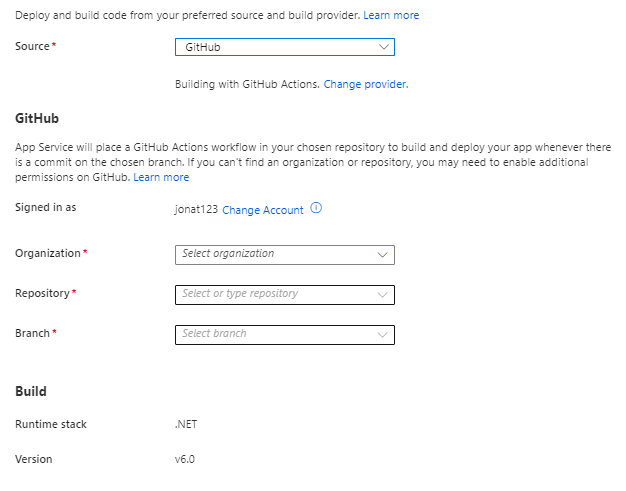
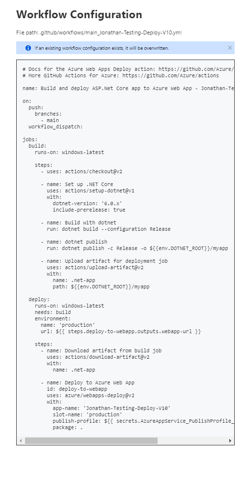

# Github actions


In this example we will show how you can set up a CI/CD build server using Github Actions in Azure Web Apps.

We will not cover how you can set up the site itself as this is beyond this documentation.


The following steps will take you through setting up a build server in Azure Web Apps. Go to the Azure portal and find the empty website that we have set up and want to connect to.

1. Go to the Deployment Center.


In the Deployment Center we can set up the CI/CD build server. With this example we are going to set up our build server by using Github Actions. It is possible to set up the build server however you want as long as it supports executing powershell scripts.

1. Go to the Settings tab.
2. Choose which source and build provider to use.
   * In this case we want to choose Github.



1. Choose the Organization which you created our Github repository under.
2. Choose the repository that was set up earlier in this guide.
3. Select which branch that we want the build server to build into.

We can see which runtime stack and version we are running, in this example we are running .NET and Version 6.0.

Once the information has been added we can go ahead and preview the YAML file that will be used for the build server:



1. Save the workflow.

The website and the Github repository are now connected.

If we go back to the Github repository we can see that a new folder have been created called Workflows:


Inside the folder, we find that the YAML file has been created with the default settings from the Azure Portal. The file will need to be configured so it fits into your set up.

1. Pull down the new file and folder, so you can work with the YAML file on your local machine.
2. Configure it to work with our Umbraco Deploy installation.

When it have been configured it will look something like this:

```yaml
# Docs for the Azure Web Apps Deploy action: https://github.com/Azure/webapps-deploy
# More GitHub Actions for Azure: https://github.com/Azure/actions
name: Build and deploy ASP.Net Core app to Azure Web App - Jonathan-deploy-v10
on:
  push:
    branches:
      - main
  workflow_dispatch:
jobs:
  build:
    runs-on: windows-latest
    steps:
      - name: Checkout the git repository
        uses: actions/checkout@v3
      - name: Setup dotnet 6
        uses: actions/setup-dotnet@v2
        with:
          dotnet-version: '6.0.x'
      - name: Build with dotnet
        working-directory: 'Jonathan-Deploy-V10'
        run: dotnet build --configuration Release
      - name: Publish with dotnet
        working-directory: 'Jonathan-Deploy-V10'
        run: dotnet publish -c Release -o ${{env.DOTNET_ROOT}}/myapp
        
      - name: Upload artifact for deployment job
        uses: actions/upload-artifact@v4
        with:
          name: .net-app
          path: ${{env.DOTNET_ROOT}}/myapp
  deploy:
    runs-on: windows-latest
    needs: build
    environment:
      name: 'Production'
      url: ${{ steps.deploy-to-webapp.outputs.webapp-url }}
    env:
      deployBaseUrl: https://jonathan-testing-deploy-v10.testsite.net
      umbracoDeployReason:  DeployingMySite
    steps:
      - name: Download artifact from build job
        uses: actions/download-artifact@v4
        with:
          name: .net-app
      - name: Deploy to Azure Web App
        id: deploy-to-webapp
        uses: azure/webapps-deploy@v2
        with:
          app-name: 'Jonathan-Deploy-V10'
          slot-name: 'Production'
          publish-profile: ${{ secrets.AZUREAPPSERVICE_PUBLISHPROFILE_ABC78A5A9E9FG07F87E8R5G9H9J0J7J8 }}
          package: .
      - name:  Run Deploy Powershell - triggers deployment on remote env
        shell: powershell
        run: .\TriggerDeploy.ps1 -InformationAction:Continue -Action TriggerWithStatus -ApiKey ${{ secrets.deployApiKey }} -BaseUrl  ${{ env.deployBaseUrl }} -Reason  ${{ env.umbracoDeployReason }} -Verbose       
```


This is only an example of how you can set up the CI/CD pipeline for Umbraco Deploy. It is possible to set it up in a way that works for you and your preferred workflow.


We also need to add the License file and `TriggerDeploy.ps1` file in an item group in the `csproj` file:

```
<ItemGroup>
<Content Include="umbraco/Licenses/umbracoDeploy.lic" CopyToOutputDirectory="Always"/>
<Content Include="TriggerDeploy.ps1" CopyToOutputDirectory="Always"/>
</ItemGroup>
```

As well as enabling Unattended install in the **appSettings.json** file so Umbraco installs automatically:

```
"Umbraco": {
    "CMS": {
      "Unattended": {
        "InstallUnattended": true
      }
```

Before the build can work, we will need to set up our generated API key to work with the build server in GitHub Actions.

1. Open your Github repository.
2. Navigate to Settings.
3. Go to the Secrets tab.
4. Select "New repository secret".
5. Call the new secret **"DEPLOYAPIKEY"**.
6. Add the API key from the `appSettings.json` file.
7. Save the secret.

We can now go ahead and commit the configured YAML file and push up all the files to the repository.

Go to Github where you will now be able to see that the CI/CD build has started running:


The build server will go through the steps in the YAML file, and once it is done the deployment have gone through successfully:

.png>)

You can now start creating content on the local machine. Once you create something like a Document Type, the changes will get picked up in Git.

When you're done making changes, commit them and deploy them to Github. The build server will run and extract the changes into the website in Azure.

This will only deploy the schema data for our local site to your website.

You will need to transfer content and media from the backoffice on your local project using the [queue for transfer feature](../../deployment-workflow/content-transfer.md).
