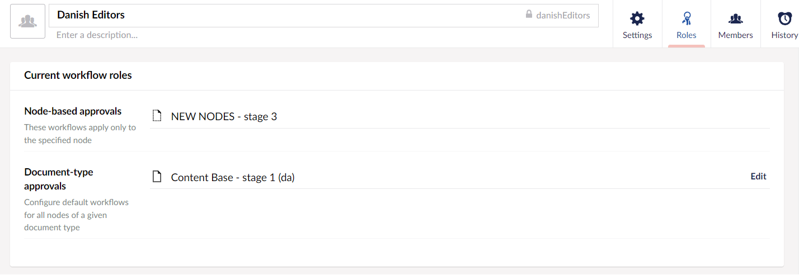
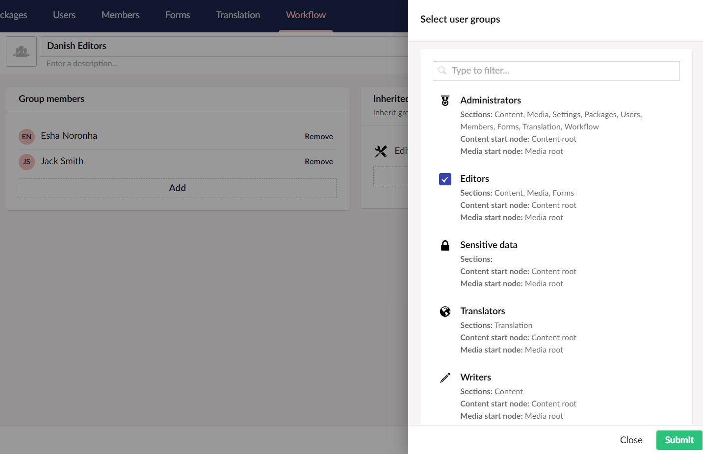
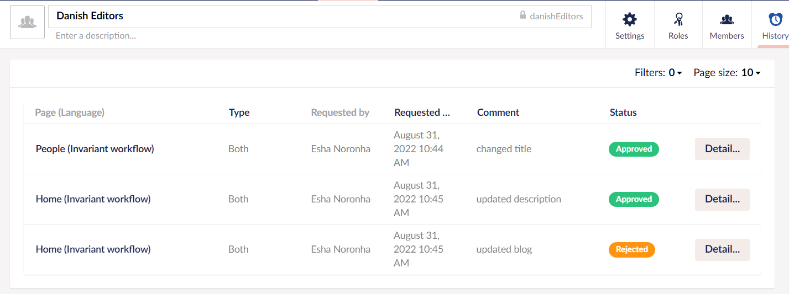

# Approval Groups

The **Approval groups** view in the **Workflow** section lists the active groups name, group members, their permissions, and a quick link to email the group.

To add an approval group, follow these steps:

1. Go to the **Workflow** section.
2. Click on **Approval groups**.
3. Click **Create Group**.
4. Enter a **Name** for the Approval Group. For example: Danish Editors.
5. Enter a **Description** to remind you why the group exists.
6. Enter the group's **Email** address in the Settings section to which the notifications will be sent.
7. Select the **Language** from the drop-down list.
8. **Enable offline approval** to allow users in this group to approve changes without logging in to the backoffice.
9.  Click **Save Group**.

    <figure><figcaption>
Create Approval Groups
</figcaption></figure>


You can create a total of 5 groups on unlicensed installations. The paid license removes this restriction.


You can search for a specific group using the Search bar. Select a group from the list to edit its Settings, Roles, Members, and view the group's History.

## Approval Groups Settings

The **Settings** tab consists of the following fields:

* **Group Email:** Workflow notifications are sent to a generic inbox (a group's email address) rather than the individual group members.
* **Language:** Select a language variant for the email.
* **Enable Offline approval:** Allow the users of this group to approve changes without logging in to the Backoffice. For more information, see the [Enable Offline approval](approval-groups.md#enable-offline-approval) section. This feature requires a paid license.

### Enable Offline Approval

You can optionally provide Groups permission to action workflow tasks without logging in to Umbraco. This feature requires a paid license. By Enabling Offline Approval, all email notifications sent to the group members will include a personalized link to a preview page.

The preview page exposes the current saved page with the options to approve or reject the change. It is not possible to edit the content from the offline approval view.

This feature is useful where the approval group membership is a single user who does not use Umbraco. For example, a manager may want to approve media releases before publishing but does not otherwise need access to Umbraco.

Offline approval requires a user to exist in the Backoffice and be assigned to a workflow group. They do not need to know how to use Umbraco or even know their login credentials.

## Roles

The **Roles** tab provides an overview of the current workflow roles for the Group:

* **Node-based approvals**: This workflow applies only to the specified node.
* **Document-type approvals**: This workflow applies to all the nodes of a given Document Type.

You can set these **Roles** in the Workflow **Settings** section. For more information, see the [Workflow Settings](workflow-settings.md) article.

## Members

The **Members** tab manages the membership for the given user group. Add members to approval groups to determine which member will be responsible for approving content changes. Group Members can be explicitly added to the group or can inherit group membership from an existing Umbraco group. Ideally, group members are set explicitly to ensure changes made to Umbraco groups do not cause unexpected changes to workflow permissions.

To add a Group member, follow these steps:

1. Go to the **Workflow** section.
2. Click on **Approval groups**.
3. Select a group from the list to edit its Members.
4. Go to the **Members** tab.
5. Click **Add** in the **Group members** section.
6. Select the **Users** you want to add to the approval group.

    
7. Click **Save Group**.

To remove a Group member, click **Remove**.

To inherit an existing Umbraco group membership, follow these steps:

1. Go to the **Workflow** section.
2. Click on **Approval groups**.
3. Select a group from the list to edit its Members.
4. Go to the **Members** tab.
5. Click **Add** in the **Inherited group membership** section.
6. Select the **User groups** you want to add to the approval group.

    
7. Click **Save Group**.

To remove a Group membership, click **Remove**.

## History

The History tab provides an overview of the workflow activity for the current group. It displays a table containing the following details:

* Page name with the Language variant
* Type of workflow roles (Node-based approvals or Document type approvals)
* Workflow requested by
* Date the workflow was requested on
* Comment describing the changes
* Status of the workflow

You can also **Filter** the records based on the Node, Requested by, Created date, Completed date, Page Language, Workflow Type, and Workflow Status. Additionally, you can adjust the total number of records displayed on a page.

The **Detail** button at the end of the record displays an overlay with content similar to the [Active workflow](../getting-started/workflow-content-app.md#active-workflow) sub-section.

