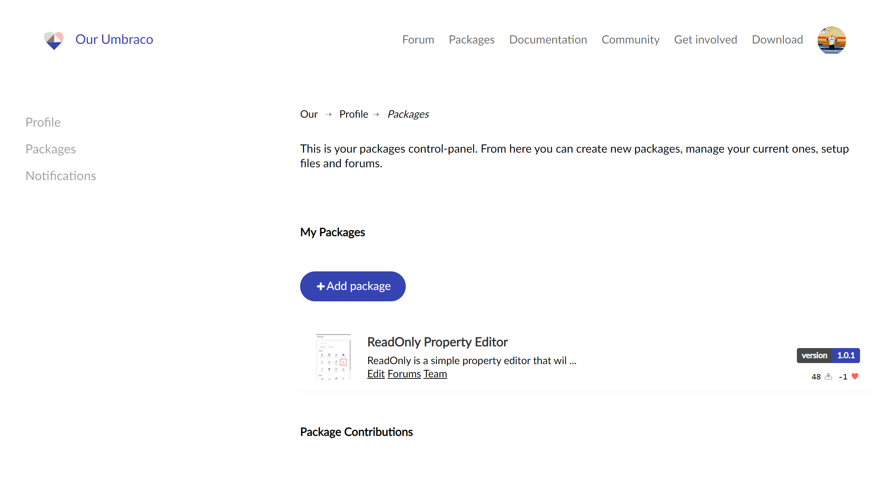

# Uploading to Our

This document shows you how to upload your package to Our and share it with the world.

To get started you first need to have an account on Our. Don't have an account? Head on over to the site and [register](https://our.umbraco.com/member/Signup).


Our uses a karma system where you get positive karma for answering forum posts, etc. To limit spam you will need to earn a little bit of karma before you can upload a package. Otherwise you can reach out to the [Umbraco support team](https://umbraco.com/contact-us/), who can help you out.


## Creating your package

Before you can upload your package, you first have to create your package. Read over the [Creating a Package](creating-a-package.md) article.

### Uploading the package to Our

To get started head over to your [profile page](https://our.umbraco.com/member/profile/). It will tell you on this page if you have enough karma to upload your package, if you do then click `Add Package`.

You may notice if you followed the [Creating a Package](creating-a-package.md) document that a lot of this information has already been entered. This isn't automatically pulled from the package file and will need to be entered again.

The form will save each page as you go and the package won't become live until you finish the process and mark it live on the final page. This means you can come back and finish your package submission at any time.

## Package Details

| Property            | Value                                    | Note                                                                                                    |
| ------------------- | ---------------------------------------- | ------------------------------------------------------------------------------------------------------- |
| Title               | My Package                               | The name of your package                                                                                |
| Current version     | x.x.x                                    | The version of your package. This will display on the front end in the button (regardless of file name) |
| Package Category    | E.g. Backoffice Extension                | The category this package should be put into.                                                           |
| Package Description | This package will extend the backoffice. | Be clear and to the point about what your package does.                                                 |
| License name        | MIT License                              | As input in Umbraco                                                                                     |
| License URL         | http://opensource.org/licenses/MIT       | As input in Umbraco                                                                                     |

### Resources

| Property          | Value               | Note                                                                                                                     |
| ----------------- | ------------------- | ------------------------------------------------------------------------------------------------------------------------ |
| Package URL       | https://umbraco.com | This URL will be shown as the package's URL when others install it. Will likely be a Github repo, or similar.            |
| Demonstration URL | https://umbraco.com | If you have a video, blog, audio description of how your package works in more depth, this is the place to advertise it. |
| Source code URL   | https://umbraco.com | A link to the source code of the package.                                                                                |
| NuGet package URL |                     | A link to the NuGet listing of your package if available.                                                                |
| Bug tracking URL  |                     | If you want people to submit bugs in a specific place, pop the link in here.                                             |

### Analytics and tracking

| Property              | Value         | Note                                                                               |
| --------------------- | ------------- | ---------------------------------------------------------------------------------- |
| Google Analytics code | UA-11111111-1 | This will include statistics from your package into your Google Analytics account. |

### Collaboration

| Property                               | Value      | Note                                                                                                                                      |
| -------------------------------------- | ---------- | ----------------------------------------------------------------------------------------------------------------------------------------- |
| This package is open for collaboration | True/false | This currently sets an internal flag for the package and doesn't lead to any difference in display of the package details to other users. |

### Package status

| Property                | Value                                          | Note                                                                                                                |
| ----------------------- | ---------------------------------------------- | ------------------------------------------------------------------------------------------------------------------- |
| This package is retired | _Tick_                                         | Tick this box if you are no longer actively maintaining the package.                                                |
| Retired message         | I no longer have time to work on this package. | A quick message to explain why you are not maintaining the package. This will be shown to your Our package listing. |

## Package Files

This is where you upload your package zip along with any other files you'd like the community to see. You can have multiple versions of your package uploaded at any one time.

| Property               | Value             | Note                                                                                                                           |
| ---------------------- | ----------------- | ------------------------------------------------------------------------------------------------------------------------------ |
| File Upload            | _File upload_     | Select the file from your local computer                                                                                       |
| Type                   | Package           | This determines where the file gets displayed within your package details page.                                                |
| Umbraco Version        | _Multiple checks_ | It's important to only mark the versions that the file is applicable to.                                                       |
| .NET Framework Version | 4.7.2             | Typically the framework you developed against. If your package doesn't have any code files then select the earliest framework. |

### Images

Images really show off your package and let people see what it can do at a glance. Select the image to upload. Marking an image as the current image will make it the icon for the package and display on the list as well as on the details page.


Setting an image to current will overwrite the setting that was made in Umbraco when creating the package zip.


### Creation Complete

Check the box here and click save to make the package live.
