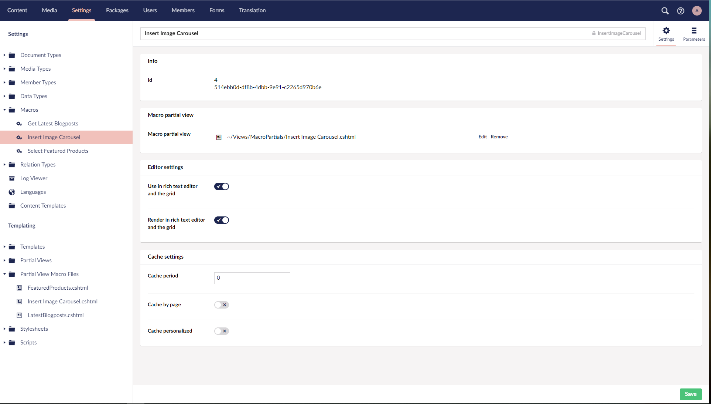
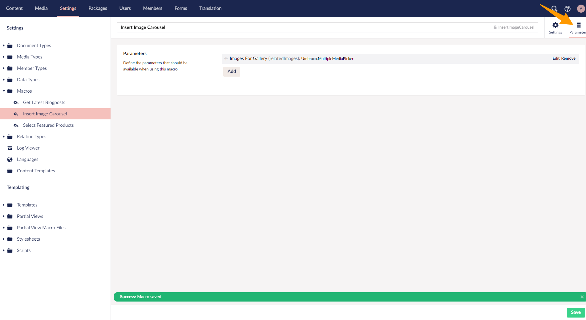
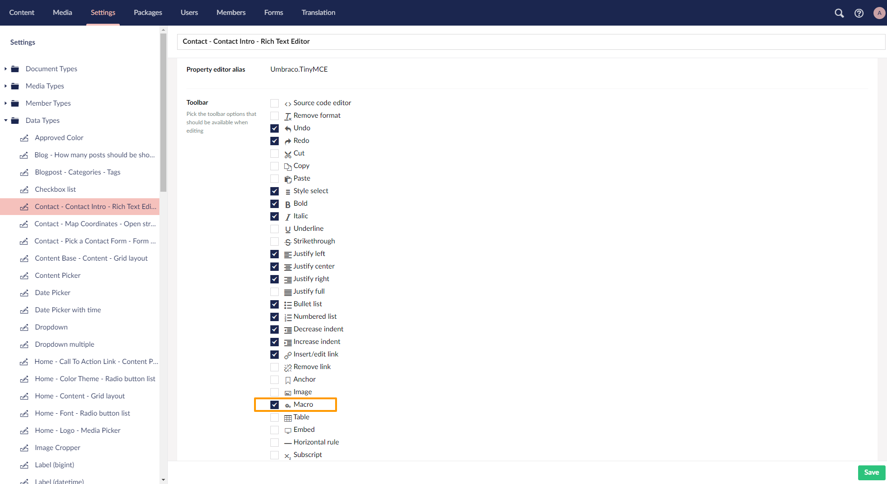
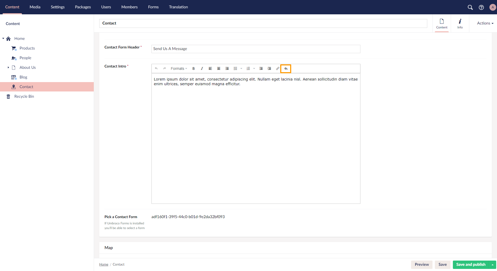
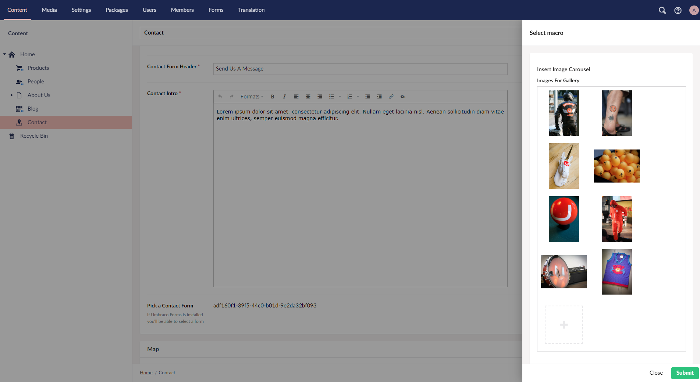

# Macros

_Defines the different types of macros and provides details on the different macro engine APIs and their usage_

## What is a macro

A macro is 'wrapper' for a reusable piece of functionality that you can utilise in different places throughout your site.

You can use macros in your templates, like MVC Partial views - however they differ in that they can be configured to work with Parameters and Caching, that can be updated by editors via the Umbraco Backoffice. So if you allow a macro to be added to a Rich Text Editor or Grid cell, the editor, at the point of inserting the macro can supply the parameter values.

For example imagine adding an Image Gallery within a rich text editor, and at the point of insertion 'picking' the images to display.



Define the parameters



Using in a Rich Text Area

A Rich Text Editor should be enabled with macros in the toolbar to allow inserting macros.



Rich Text Area with macro toolbar option



Insert the macro into a Rich Text Area



The same implementation logic can be used in lots of different places on your site, and the editor can customise the output by choosing different parameters.

## Implementing a Macro

Macros can be implemented using an MVC Partial View - [Partial View Macros](partial-view-macros.md). It uses the exact same syntax and objects as [MVC views](../mvc/).

## Rendering Macros

Here's a basic method to render macros:

```csharp
@await Umbraco.RenderMacroAsync("myMacroAlias")
```

### Rendering Macros with Parameters

This renders a macro with some parameters using an anonymous object:

```csharp
@await Umbraco.RenderMacroAsync("myMacroAlias", new { name = "Ned", age = 28 })
```

This renders a macro with some parameters using a dictionary

```csharp
@await Umbraco.RenderMacroAsync("myMacroAlias", new Dictionary<string, object> {{ "name", "Ned"}, { "age", 27}})
```

#### Meaning of all the symbols

**Request Collection**

To retrieve a value from the request collection such as a query string parameter we specify it by prefixing with an "@" symbol.

To get a query string parameter with the key "productId" we would specify our parameter like this **\[@productId]**

**Document Type Property**

Document type properties are specified by a leading "#" and then the alias of the document property.

To pass a property with the alias "bodyText" we would specify **\[#bodyText]** in the parameter value.

**Recursive Document Type Property**

Recursive Document type properties are specified by a leading "$" and then the alias of the document property.

Umbraco resolves recursive parameters by looking at the current page for a value and then traversing up the content tree until a value with that alias is found.

**Session Collection**

Retrieve values from the session collection or cookies by prefixing with a "%" symbol.

To retrieve a value with the key "memberId" from the session collection we would specify our Macro parameter value as **\[%memberId]**

### Caching Macro Output

For long running macros that return the same results, caching boosts site performance, you can specify caching levels for the Macro in the backoffice.

Options are:

* Cache by Period - set the number of seconds to cache the output of the Macro for
* Cache by Page - Whether to create a different cached instance of the macro for each page (think breadcrumb - you wouldn't want the same breadcrumb on every page)
* Cache Personalized - whether to create a difference cached instance of the macro for each site visitor (if your Macro says 'Hi Niels' using the currently logged in Members name, you wouldn't want this cached to be the same for every visitor to the site, unless they were all called Niels)
