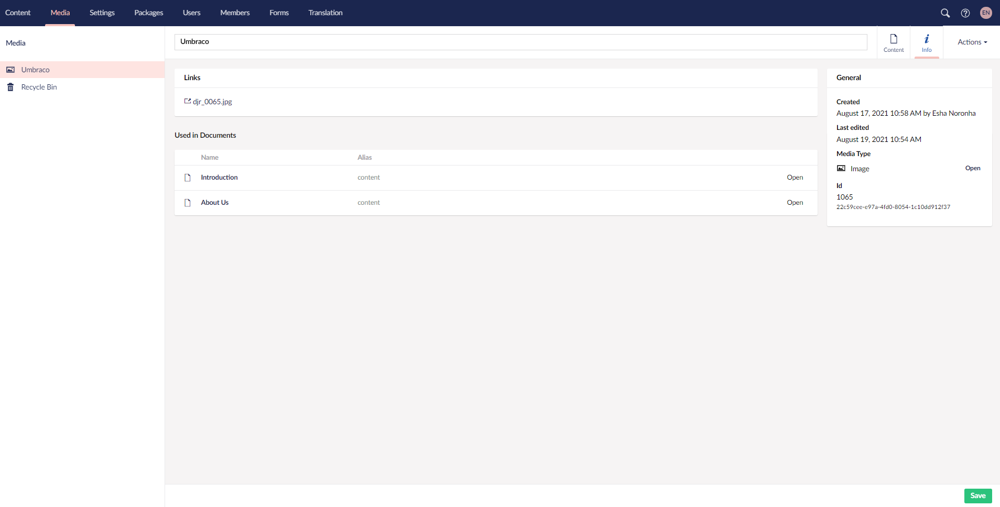
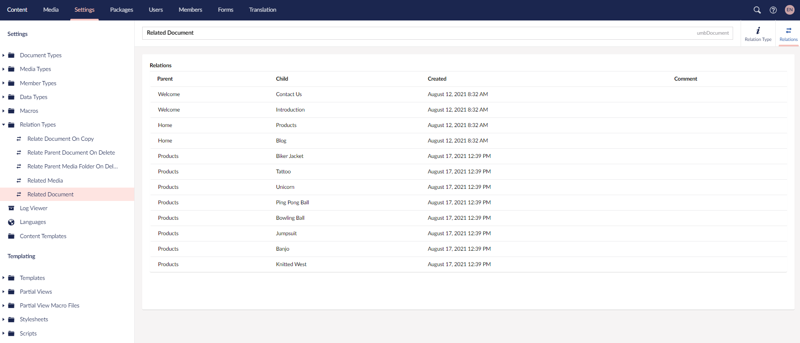

# Tracking References

Property editors can be extended further to track entity references that may be selected or referenced inside the property editor. For example in the core of the CMS we have added this to numerous property editors.

A good example of this is the Media Picker. The CMS stores a reference to the selected media item, enabling the identification of content nodes that use that particular media item. This avoids it being accidentally deleted if it is being used.

When a content node is saved it will save the entity references as relations.

## Viewing References

### For Media Items

1. Go to the **Media** section.
2.  Select a media item and click the **Info** tab.

    

### For Content Nodes

1. Go to the **Settings** section.
2.  Under the **Relation Types** folder, select **Related Document** relations and click **Relations**.

    

### For Data Types

1. Go to the **Settings** section.
2. Expand the **Data Types** folder.
3. Select the **Data Type** you wish to view the references
4.  Navigate to the **Info** tab.

    

## Example

The following example shows how to implement tracking for the inbuilt CMS property editor **Content Picker**. It will always add a specific media reference, regardless of what value is picked in the content picker. In your own implementations, you will need to parse the value stored from the property editor you are implementing. You will also need to find any references to picked items in order to track their references.

```csharp
using System;
using System.Collections.Generic;
using Umbraco.Cms.Core;
using Umbraco.Cms.Core.Composing;
using Umbraco.Cms.Core.DependencyInjection;
using Umbraco.Cms.Core.Models;
using Umbraco.Cms.Core.Models.Editors;
using Umbraco.Cms.Core.PropertyEditors;
using Umbraco.Extensions;

namespace Umbraco.Web.PropertyEditors;

public class ExampleComposer : IComposer
{
    public void Compose(IUmbracoBuilder builder)
    {
        builder.DataValueReferenceFactories().Append<TrackingExample>();
    }
}

public class TrackingExample : IDataValueReferenceFactory, IDataValueReference
{
    public IDataValueReference GetDataValueReference() => this;

    // Which Data Editor (Data Type) does this apply to - in this example it is the built in content picker of Umbraco
    public bool IsForEditor(IDataEditor dataEditor) => dataEditor.Alias.InvariantEquals(Constants.PropertyEditors.Aliases.ContentPicker);


    public IEnumerable<UmbracoEntityReference> GetReferences(object value)
    {
        // Value contains the raw data that is being saved for a property editor
        // You can then analyse this data be it a complex JSON structure or something more trivial
        // To add the chosen entities as references (as any UDI type including custom ones)

        // A very simple example
        // This will always ADD a specific media reference to the collection list
        // When it's a ContentPicker datatype
        var references = new List<UmbracoEntityReference>();
        var udiType = ObjectTypes.GetUdiType(UmbracoObjectTypes.Media);
        var udi = Udi.Create(udiType, Guid.Parse("fbbaa38d-bd93-48b9-b1d5-724c46b6693e"));
        var entityRef = new UmbracoEntityReference(udi);
        references.Add(entityRef);
        return references;
    }
}
```
