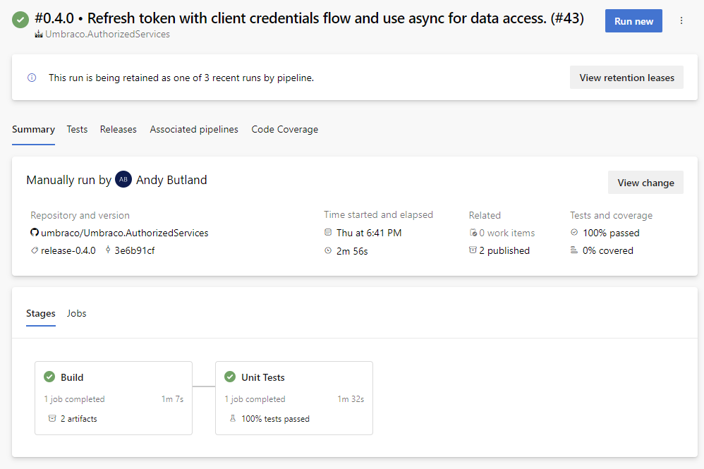
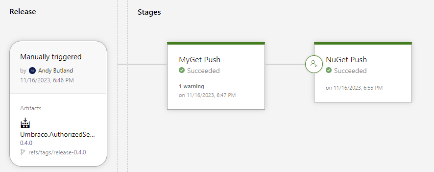

# An Example Package Repository

There are many ways to build and deploy your package to NuGet. You will likely have your own approach for organizing a solution and preferred tools for build and deployment.

It may be useful though to review some practices we share here, of how we build packages at Umbraco.

Some add-ons to the CMS created by Umbraco are closed-source, but we have some we make freely available with open-source repositories.  An example is [Umbraco.AuthorizedServices](../../../../marketplace-and-integrations/packages/authorized-services.md), that has a source code repository [here on GitHub](https://github.com/umbraco/Umbraco.AuthorizedServices).

## Solution Organization

The solution consists of three projects.

### Package Project

The [main package project](https://github.com/umbraco/Umbraco.AuthorizedServices/tree/main/src/Umbraco.AuthorizedServices) lives in `src/<ProjectName>`.  It contains in the project file a dependency on Umbraco CMS:

```xml
<PackageReference Include="Umbraco.Cms.Web.BackOffice" Version="[10.0, 14)" />
```

Here we provide an upper bound on the package. This ensures that developers can only install it into projects that are using versions of Umbraco that we have tested the package with.

When the next major version of Umbraco is released, we'll test and either extend the range or release a new version, as appropriate.

### Tests Project

We have a [project for unit tests](https://github.com/umbraco/Umbraco.AuthorizedServices/tree/main/tests/Umbraco.AuthorizedServices.Tests) in `tests/<ProjectName>.Tests`.  It contains references to `Umbraco.Cms.Tets` and a project reference to the package:

```xml
<ProjectReference Include="..\..\src\Umbraco.AuthorizedServices\Umbraco.AuthorizedServices.csproj" />
```

### Example Website

Finally there's an [example Umbraco website](https://github.com/umbraco/Umbraco.AuthorizedServices/tree/main/examples/Umbraco.AuthorizedServices.TestSite) that we use for manual testing of the package.  It also has a project reference to the package project, allowing us to test updates as they are compiled.

### Solution Items

As well as the projects, the following files are added to the solution:

- [.artifactignore](https://github.com/umbraco/Umbraco.AuthorizedServices/blob/main/.artifactignore) - used by AzureDevOps services to [control which files are uploaded when you publish](https://learn.microsoft.com/en-us/azure/devops/artifacts/reference/artifactignore?view=azure-devops). This helps to reduce pipeline execution time.
- [.editorconfig](https://github.com/umbraco/Umbraco.AuthorizedServices/blob/main/.editorconfig) - used to [enforce consistent coding styles](https://editorconfig.org/) for multiple developers working on the same project across editors and IDEs.
- [.gitignore](https://github.com/umbraco/Umbraco.AuthorizedServices/blob/main/.gitignore) - controls which files are added to source control.
- [.globalconfig](https://github.com/umbraco/Umbraco.AuthorizedServices/blob/main/.globalconfig) - provides [further styling rules for the project files, even if stored outside of the project directory](https://learn.microsoft.com/en-us/dotnet/fundamentals/code-analysis/configuration-files#global-analyzerconfig).
- [Directory.Build.props](https://github.com/umbraco/Umbraco.AuthorizedServices/blob/main/Directory.Build.props) - used to provide common setting across all projects in the solution.
- global.json - ensures that the solution is always [built with a consistent version of .NET](https://learn.microsoft.com/en-us/dotnet/core/tools/global-json). We add this when we have a solution that targets a single Umbraco major version.
- [LICENSE.md](https://github.com/umbraco/Umbraco.AuthorizedServices/blob/main/LICENSE.md) - indicates the license through which the code is available.
- [README.md](https://github.com/umbraco/Umbraco.AuthorizedServices/blob/main/README.md) - a top-level documentation page for the source code repository.
- [icon.png](https://github.com/umbraco/Umbraco.AuthorizedServices/blob/main/icon.png) - an icon used for the package on NuGet and the Umbraco Marketplace.
- [umbraco-marketplace.json](https://github.com/umbraco/Umbraco.AuthorizedServices/blob/main/umbraco-marketplace.json) - provides [additional details about the package when listed on the Umbraco Marketplace](https://docs.umbraco.com/umbraco-dxp/marketplace/listing-your-package).
- [version.json](https://github.com/umbraco/Umbraco.AuthorizedServices/blob/main/version.json) - provides package versioning information for use by [Nerdbank.GitVersioning](https://github.com/dotnet/Nerdbank.GitVersioning). We use this tool for generating version numbers.

## Build and Deployment

We use AzureDevOps pipelines for continuous integration and releasing new versions of the package. The definition of how the project is built is defined in a `.yaml` file that's part of the source code repository.

The file can be found [here](https://github.com/umbraco/Umbraco.AuthorizedServices/blob/main/azure-pipeline%20-%20Umbraco.AuthorizedServices.yml).

Even if using another tool it may be worth reviewing how we have setup our pipeline. It may be you can setup something similar with your own provider.

### Building the Package

The build consists of two stages: building the solution and running unit tests. Only if both succeed is the build as a whole considered successful.



### Releasing the Package

We release the package manually in AzureDevOps, with a two stage process. Firstly we release to a "pre-releases" feed, and then after manual approval, to NuGet.




