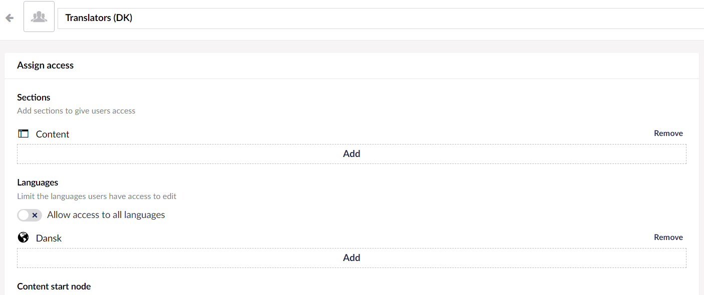

# Language Variants

Language Variants allows you to vary content by culture, so you can allow a content node to exist in multiple languages.

This article will cover the different aspects of enabling and working with language variants on your Umbraco website.

## Contents

* [Video tutorial](variants.md#video-tutorial)
* [How to enable Language Variants](variants.md#how-to-enable-language-variants)
* [Enabling Language Variants on Document Types](variants.md#enabling-language-variants-on-document-types)
* [Working with Language Variants on content](variants.md#working-with-language-variants-on-content)
* [Test your language variants](variants.md#test-your-language-variants)
* [Control User Group permissions on language variants](variants.md#control-user-group-permissions-on-language-variants)
* [Related Links](variants.md#related-links)

## Video tutorial


How to use Language Variants in Umbraco


## How to enable Language Variants

To work with Language Variants you need to have more than one language enabled. This can be done from the `Settings` section:


You will always have one default language but each language can be set to mandatory.


## Enabling Language Variants on Document Types

Now that there are two languages to vary the content with, it needs to be enabled on the Document Types. To do so:

1. Go to the Document Type in the **Settings** section.
2. Open the **Permissions** page.
3.  Toggle **Allow vary by culture**.

    <figure><figcaption></figcaption></figure>

To allow a property on the Document Type to be varied it will have to be enabled for the property:

## Working with Language Variants on content

When you return to your content node you will notice two things:

1. At the top of the Content tree there will now be a dropdown so you can show the Content tree in the language of your choice.
2.  To the right of the content name there is now a dropdown where you can select a language. You can also open a split view so you can see two languages at once.

    

Each Property Editor that does not allow variants (an Invariant Property) will by default need to be unlocked in order to be edited. The lock exists to make it clear that this change will affect more languages. Since the value of the invariant properties are shared between all variants on the website.


Whether or not the lock is enabled on the invariant properties depends on the `AllowEditInvariantFromNonDefault` setting in the `appsettings.json` file.

For projects created on Umbraco version 10.2 or later, the setting is `true`, by default. If the project is upgraded to version 10.2 or later, the setting will by default be `false`.

Learn more about the `AllowEditInvariantFromNonDefault` setting in the [Security Settings](../../reference/configuration/securitysettings.md) article.


To read about how you render variant content in Templates, check out the [rendering content section](../design/rendering-content.md).

## Test your language variants

Culture and hostnames must be added to your language sites before the content can be tested for variants:

1. Right-click the Home node and select **Culture and hostnames...**.
2. Add a specific URL per language and save. For eg: An English language variant with English (United States) as the language can be given a specific URL `https://yourwebsite.com/en-us` and a Danish language variant can be given a specific URL `https://yourwebsite.com/dk`.

The Info content app should now show specific URLs for your language variants.

## Control User Group permissions on language variants


This feature is available from Umbraco version 10.2.


When you are working with a multilingual site you might want to control who can edit the different variations of the content on the website.

This can be controlled on a User Group level. All default User Groups, except the Sensitive data group, have access to all languages out of the box.

When "Allow access to all languages" is not checked, languages can be added and/or removed. This is to determine which variants the users in the user group have access to.


Even though the language permissions have been set, a user will still be able to view and browse all the language variations. The permission setting will ensure that only the added languages are editable by users of the User Group.


## Related Links

* [Umbraco 8: Language Variants (official blog post from Umbraco HQ)](https://umbraco.com/blog/umbraco-8-language-variants/)
* [Language variations](../../reference/language-variation.md)
* [Render varied content in Templates](../design/rendering-content.md)
