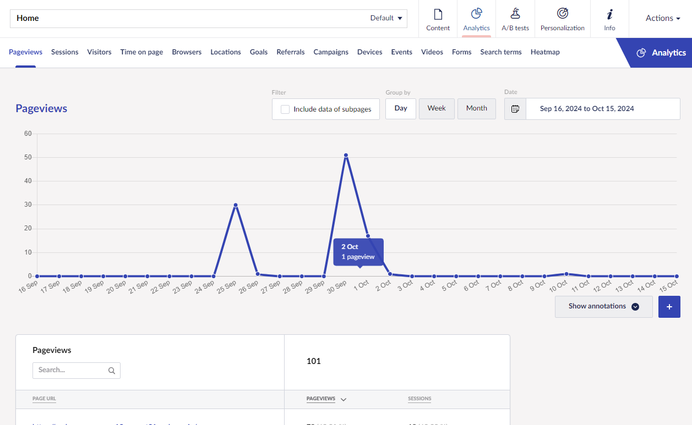
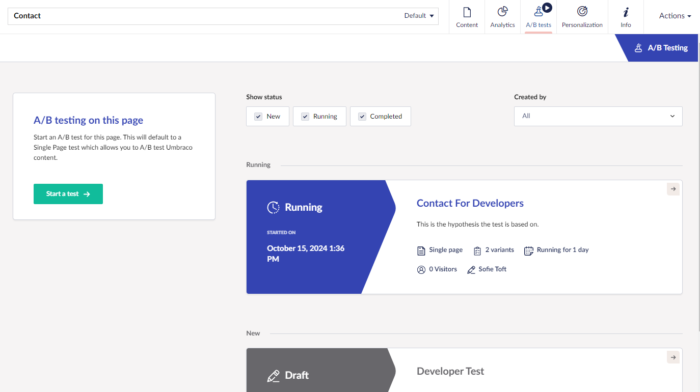
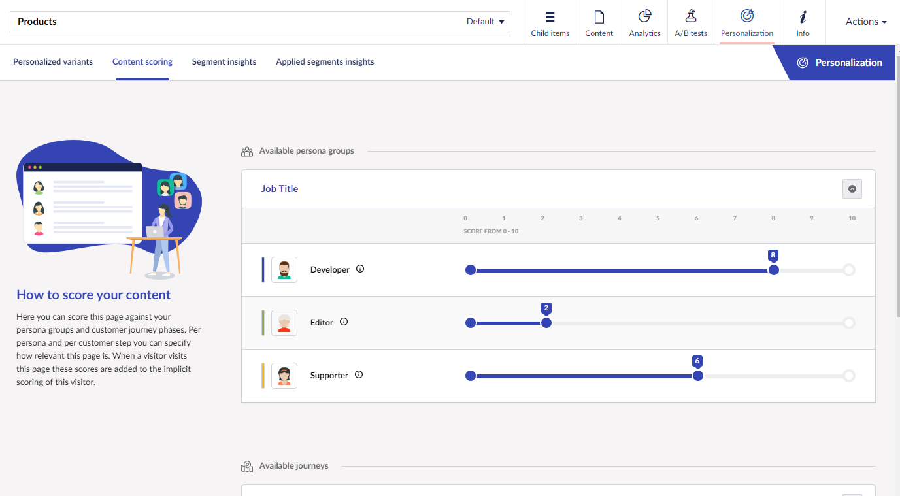
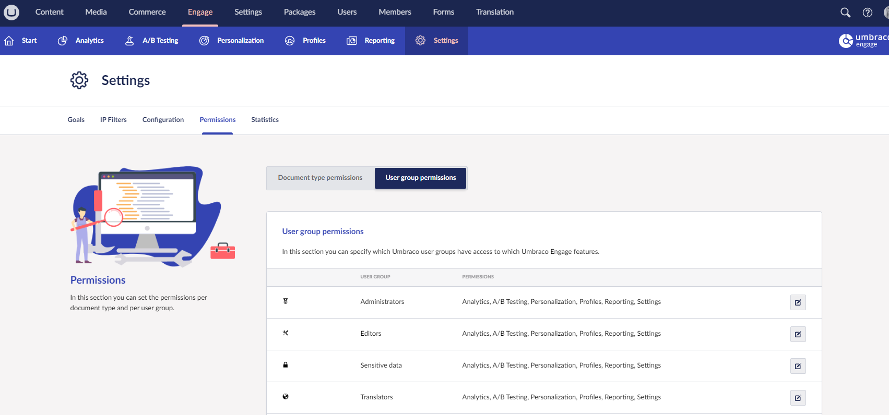

# Content Apps

In the Content section of Umbraco, you will see all Umbraco nodes and most of them will relate to a specific page in your website. If you have installed the Umbraco Engage each Umbraco node will have three extra Content Apps.

## Analytics

If you navigate to a node you will see the Analytics content app. If you open the Content App the Analytics data of this specific node is loaded.

## A/B Testing

The A/B testing content app will allow you to test your Umbraco node within the splitview functionality. Every Document Type can be A/B tested:

## Personalization

The Personalization content app allows you to score a specific page based on the customer journey and persona (for implicit content scoring).

It also allows you to setup personalized variants of each node.

## Managing the access to content apps

In the **Engage** -> **Settings** section, you can manage which Document Types the content apps are displayed, and which Umbraco user groups can access them. They can be  managed per Document Type and per user group

