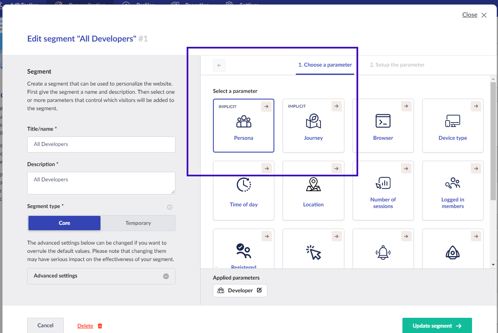
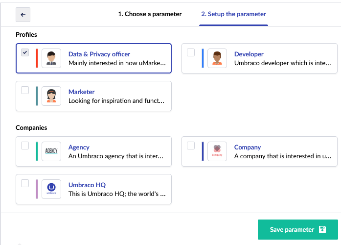

# Implicit and Explicit Personalization

## Explicit Personalization

This is the "**easiest**" concept to grasp. For every explicit parameter Umbraco Engage is true or false. For example, the browser parameter is an example of an explicit parameter. Suppose the visitor is using a Chrome browser, or not. There cannot be much debate about this and the parameter returns "`true`" or "`false`".

Most parameters within Umbraco Engage are explicit and true or false.

## Implicit Personalization

The unique part of Umbraco Engage is that it also uses implicit personalization. Based on the behavior of a specific visitor Umbraco Engage can assume that a visitor is a specific persona or customer journey phase.

This article teaches you how to set up[ the customer journey](setting-up-the-customer-journey.md) or [personas](setting-up-personas.md). As soon as you have set these up you can use the segment parameters for the customer journey and the personas.

In the [segment builder](../creating-a-segment.md), you can use these implicit parameters the same way you would apply any other segment parameter.

By clicking personas you will see an overview of all the personas that you have set up within your installation.

In our case, we see the persona groups **Profiles** and **Companies** and the personas **Data & Privacy Officer**, **Developer**, **Marketer**, **Agency**, **Company** and **Umbraco HQ**. If we want to create a segment for all personas that are **Data & Privacy officer** add that persona as a parameter to the segment.

From now on you can use this segment to personalize the experience of your visitors.

You can mix and match implicit and explicit segment parameters. If you want to create a segment for the persona "**Marketer**" which is using the browser "**Firefox**" and **is logged in**, that is perfectly fine!

If you want to see how the algorithm works read the documentation or see it in action on your website with the [Umbraco Engage cockpit](../cockpit-insights.md).
