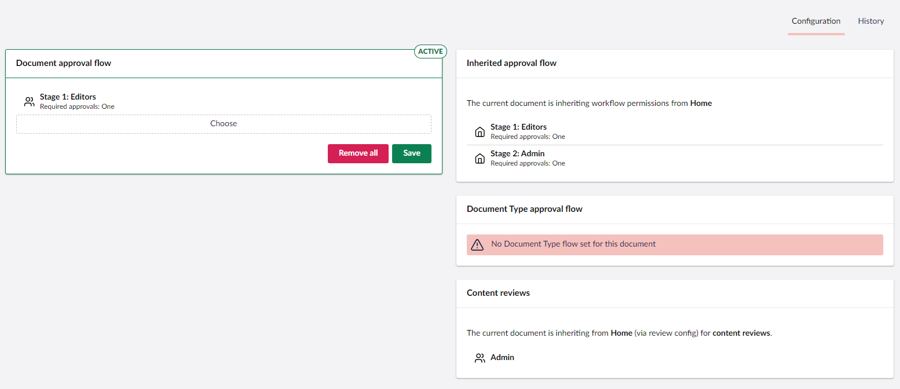
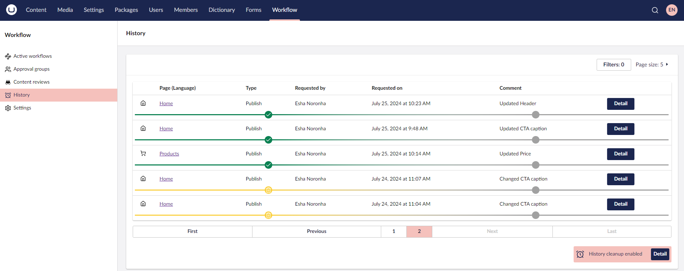

# Content App

Umbraco Workflow adds a [Content App](https://docs.umbraco.com/umbraco-cms/extending/content-apps) to all content nodes in the **Content** section where a workflow is enabled. The Workflow content app includes three sub-sections:

* [Active Workflow](workflow-content-app.md#active-workflow)
* [Configuration](workflow-content-app.md#configuration)
* [History](workflow-content-app.md#history)

## Active Workflow

The Active workflow sub-section provides an interface for managing workflows for the current content node.

When the current node is pending workflow approval, the **Active workflow** sub-section displays detailed information such as:

* Option to [approve, reject, or cancel pending workflow tasks](workflow-content-app.md#approve-reject-or-cancel-pending-workflow-tasks).
* View change description and track differences across pending and completed workflows.
* View the group responsible for approving the pending workflow.
* View pending language variant(s) workflow.
* View the workflow activity (eg. pending approval/task approvals/rejects) for the current workflow process.

You can access Active Workflows from two places - the **Content** section and the **Workflow** section (depending on your user permission). Workflow Administrators (those users with access to the Workflow section) can access workflows assigned to a different group. In the **Workflow History**, these are noted as being performed by the admin.

### Approve, Reject, or Cancel pending workflow tasks

#### Approve Workflow Tasks

To approve a Workflow task, click on the **Approve** button in the Action section.

#### Reject Workflow Tasks

To reject a Workflow task, click on the **Reject** button in the Action section. Depending on the approval stage, the reviewer can decide where to send the rejected task.

For first-stage approvals, the rejected task is sent back to the original editor/author. For second-stage approvals and above, the reviewer can send the rejected task either to the original editor or any other previous workflow group.

#### Cancel pending Workflow Tasks

To cancel a pending Workflow task, click on the **Cancel** button in the Action section.

## Configuration

The Configuration sub-section provides an interface for configuring the content approval flow for the current node. It also displays any Inherited or Document type approval flows applied to the current content node.

In multi-lingual sites, each variant can have its own approval flow. By default, new variants inherit the configuration set on the default language.

For example, German variants can be approved by the German speakers group, while English variants are approved by the English speakers group.

### Content Approval Flow

You can add different groups for different stages of content approval flow. Content Approval flow groups can be reordered via drag and drop. You can also apply the approval flow either for publish and unpublish workflows or only publish workflow.

#### Approval Flow Types

Approval Flows are available in three types: Content approval flow, Inherited approval flow, and Document type approval flow.

A given content node may have all three approval flow types applied but only one will be applied as per the following order of priority:

| Flow Type | Description | Priority |
|---|---|---|
| **Content approval flow** | Set directly on a content node via the **Configuration** section in the **Workflow** tab. | Highest |
| **Document type approval flow** | Set in the **Settings** section. Applies to all content nodes of the selected Document Type unless overridden by a Content approval flow set directly on the node. Requires a license. | Secondary |
| **Inherited approval flow** | Used when a content node has no Content approval flow set, nor a flow applied to its Document Type. Umbraco Workflow will traverse the content tree upwards to find a Content approval flow. | Lowest |

Review the current Permissions for Approval Groups in the **Approval Groups** section for **Node-based approvals** and **Document type approvals** only. For more information see the [Roles](../workflow-section/approval-groups.md#roles) section in the [Approval Groups](../workflow-section/approval-groups.md) article.

Document type approval flows may contain conditional stages, such as including **Translators** in the workflow only when the **Description** property has changed. For more information on settings conditions in Document type approval flows, see the [Document type approval flows](../workflow-section/workflow-settings.md#document-type-approval-flows) section in the [Workflow Settings](../workflow-section/workflow-settings.md) article.

Configuration cannot be modified when a content node is in a workflow process.

#### Content reviews

Content reviews is a tool that allows content editors to keep their content up-to-date. For more information, see the [Content reviews](../workflow-section/content-reviews.md) section.

## History

The History sub-section provides a chronological audit trail of workflow activity for the current node. It displays a table containing the following information:

* Type of Publish
* Who the workflow is requested by
* The date the workflow was requested
* Comments

You can also **Filter** the records based on the information listed above. Additionally, you can adjust the total number of records displayed on a page.

The **Detail** button at the end of the record displays an overlay with content similar to the Active workflow sub-section.

