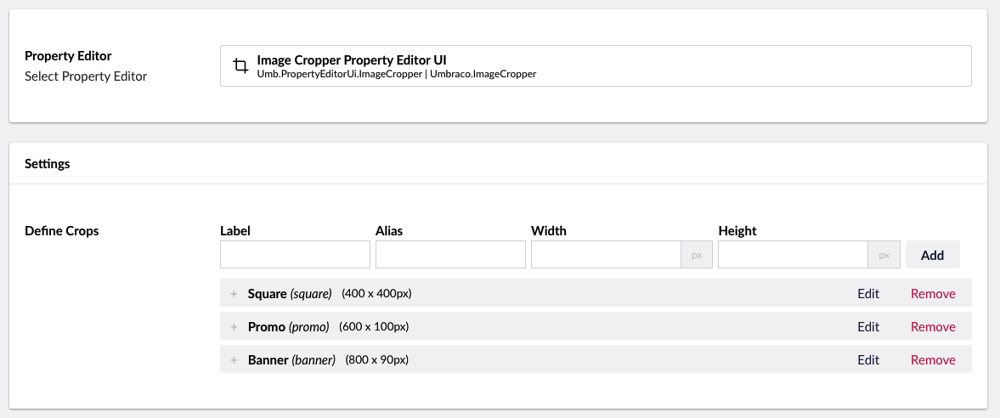
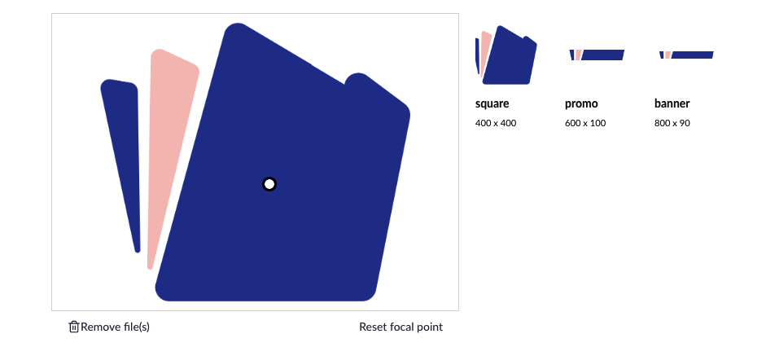
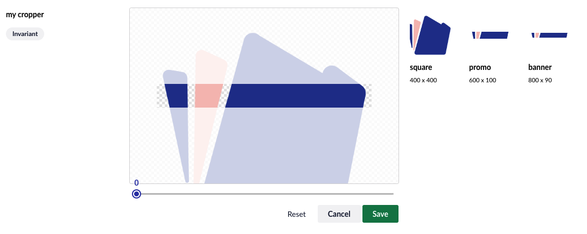

# Image Cropper

`Returns: MediaWithCrops`

Returns a path to an image, along with information about focal point and available crops.

When the Image Cropper is used on a Media Type the crops are shared between all usages of a Media Item. This is called **global crops**.

If the Image Cropper is used on a Document Type, the file and crops will be **local** to the Document.

Notice that it is possible make local crops on shared Media Items via the [Media Picker Property Editor](media-picker-3.md).

## Settings

### Define Crops

You can add, edit & delete crop presets the cropper UI can use.

## Data Type Definition Example



## Content Example

The Image Cropper provides a UI to upload an image, set a focal point on the image, and use predefined crops.

By default, images in the Image Cropper will be shown based on a set focal point and only use specific crops if they are available.

The Image Cropper comes with 3 modes:

* Uploading an image
* Setting a focal point
* Cropping the image to predefined crops

### Uploading images

The editor exposes a drop area for files. Select it to upload an image.


### Set focal point

By default, the Image Cropper allows the editor to set a focal point on the uploaded image.

All the preset crops are shown to give the editor a preview of what the image will look like on the frontend.



### Crop and resize

The editor can fit the crop to the image to ensure that the image is presented as intended.



## Powered by ImageSharp.Web

[ImageSharp.Web](https://sixlabors.com/products/imagesharp-web/) is image processing middleware for ASP.NET.

We bundle this package with Umbraco and you can therefore take full advantage of all its features for resizing and format changing. Learn more about the built in processing commands in [the official ImageSharp documentation](https://docs.sixlabors.com/articles/imagesharp.web/processingcommands.html).

## Sample code

The Image Cropper comes with an API to generate crop URLs. You can also access the raw data directly as a dynamic object.

For rendering a cropped media item, the `.GetCropUrl` is used:

```html

```

The third parameter is `HtmlEncode` and is by default set to true. This means you only need to define the parameter if you want to disable HTML encoding.

### Example to output a "banner" crop from a cropper property with the property alias "customCropper"

```html

```

Or, alternatively using the `MediaWithCrops` extension method:

```html

```

### Example to dynamically create a crop using the focal point - in this case 300 x 400px image

```csharp
@if (Model.Photo is not null)
{
    
}
```

### CSS background example to output a "banner" crop

Set the `htmlEncode` to false so that the URL is not HTML encoded

```csharp
@if (Model.Photo is not null)
{
    var cropUrl = Url.GetCropUrl(Model.Photo, "square", false);
    <style>
        .myCssClass {
            background-image: url("@cropUrl");
            height: 400px;
            width: 400px;
        }
    </style>
    <div class="product-image-container myCssClass"></div>
}
```

## Add values programmatically

To update a content property value you need the [Content Service](https://apidocs.umbraco.com/v15/csharp/api/Umbraco.Cms.Core.Services.ContentService.html).

The following sample demonstrates how to add or change the value of an Image Cropper property programmatically. The sample creates an API controller with an action, which must be invoked via a POST request to the URL written above the action.

```csharp
using Microsoft.AspNetCore.Mvc;
using Umbraco.Cms.Core.Models;
using Umbraco.Cms.Core.PropertyEditors;
using Umbraco.Cms.Core.PropertyEditors.ValueConverters;
using Umbraco.Cms.Core.Serialization;
using Umbraco.Cms.Core.Services;

namespace Umbraco.Docs.Samples.Web.Property_Editors_Add_Values;

[ApiController]
[Route("/umbraco/api/createimagecroppervalues")]
public class CreateImageCropperValuesController : Controller
{
    private readonly IContentService _contentService;
    private readonly IMediaService _mediaService;
    private readonly MediaUrlGeneratorCollection _mediaUrlGeneratorCollection;
    private readonly IJsonSerializer serializer;

    public CreateImageCropperValuesController(
        IContentService contentService,
        IMediaService mediaService,
        MediaUrlGeneratorCollection mediaUrlGeneratorCollection, IJsonSerializer serializer)
    {
        _contentService = contentService;
        _mediaService = mediaService;
        _mediaUrlGeneratorCollection = mediaUrlGeneratorCollection;
        this.serializer = serializer;
    }

    // /Umbraco/Api/CreateImageCropperValues/CreateImageCropperValues
    [HttpPost("createimagecroppervalues")]
    public ActionResult<bool> CreateImageCropperValues()
    {
        // Create a variable for the GUID of the page you want to update
        var contentKey = Guid.Parse("89974f8b-e213-4c32-9f7a-40522d87aa2f");

        // Get the page using the GUID you've defined
        IContent? content = _contentService.GetById(contentKey);
        if (content == null)
        {
            return false;
        }

        // Create a variable for the GUID of the media item you want to use
        var mediaKey = Guid.Parse("b6d4e98a-07c0-45f9-bfcc-52994f2806b6");

        // Get the desired media file
        IMedia? media = _mediaService.GetById(mediaKey);
        if (media == null)
        {
            return false;
        }

        // Create a variable for the image cropper and set the source
        var imageCropperValue = new ImageCropperValue
        {
            Src = media.GetUrl("umbracoFile", _mediaUrlGeneratorCollection)
        };

        // Serialize the image cropper value
        var propertyValue = serializer.Serialize(imageCropperValue);

        // Set the value of the property with alias "cropper"
        // - remember to add the "culture" parameter if "cropper" is set to vary by culture
        content.SetValue("cropper", propertyValue);

        return _contentService.Save(content).Success;
    }
}
```

If you use Models Builder to generate source code (modes `SourceCodeAuto` or `SourceCodeManual`), you can use `nameof([generated property name])` to access the desired property without using a magic string:

```csharp
// Set the value of the "Cropper" property on content of type MyContentType
// - remember to add the "culture" parameter if "cropper" is set to vary by culture
content.SetValue(nameof(MyContentType.Cropper).ToFirstLowerInvariant(), propertyValue);
```

## Get all the crop urls for a specific image

Crop URLs are not limited to usage within a view. `IPublishedContent` has a `GetCropUrl` extension method, which can be used to access crop URLs anywhere.

The following sample demonstrates how to use `GetCropUrl` to retrieve URLs for all crops defined on a specific image:

```csharp
public Dictionary<string, string> GetCropUrls(IPublishedContent image)
{
    // Get the Image Cropper property value for property with alias "umbracoFile"
    ImageCropperValue? imageCropperValue = image.Value<ImageCropperValue>("umbracoFile");
    if (imageCropperValue?.Crops == null)
    {
        return new Dictionary<string, string>();
    }

    // Return all crop aliases and their corresponding crop URLs as a dictionary
    var cropUrls = new Dictionary<string, string>();
    foreach (ImageCropperValue.ImageCropperCrop crop in imageCropperValue.Crops)
    {
        // Get the cropped URL and add it to the dictionary that I will return
        var cropUrl = crop.Alias != null
            ? image.GetCropUrl(crop.Alias)
            : null;
        if (cropUrl != null)
        {
            cropUrls.Add(crop.Alias!, cropUrl);
        }
    }

    return cropUrls;
}
```

## Sample on how to change the format of the image

Below the example to output a PNG using ImageSharp.Web [format](https://docs.sixlabors.com/articles/imagesharp.web/processingcommands.html#format) command.

```html

```
