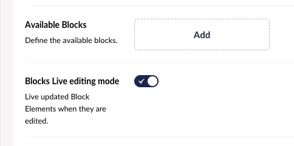
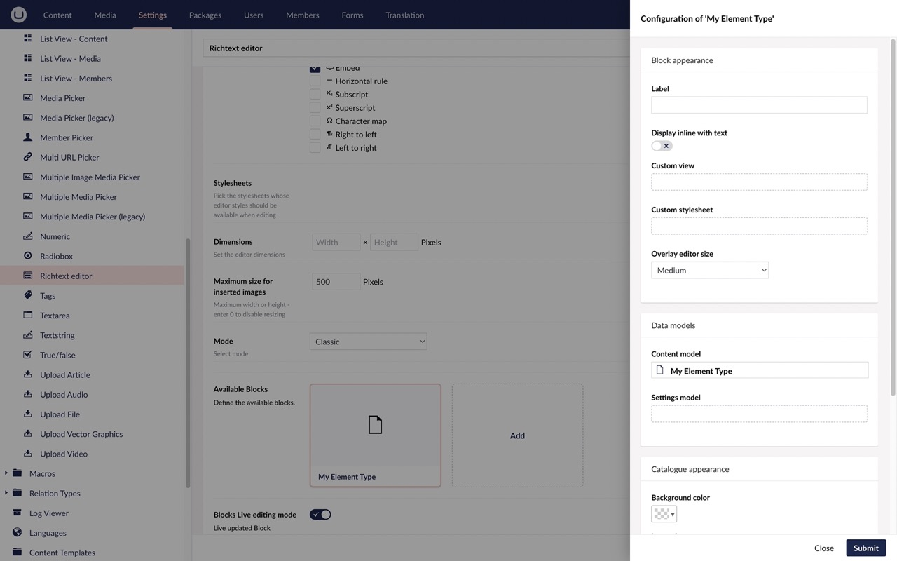

# Blocks


This article is a work in progress and may undergo further revisions, updates, or amendments. The information contained herein is subject to change without notice.


It is possible to insert Blocks into the markup of the Rich Text Editor (RTE). Block can be created directly inside the Rich Text editor when

* You have defined the Block Type as part of the RTE Data Type, and
* Enabled the Blocks Toolbar Option.

## Configure Blocks

The Block List property editor is configured in the same way as any standard property editor, via the _Data Types_ admin interface.

To set up your Block List Editor property, create a new _Data Type_ and select **Block List** from the list of available property editors.

Then you will see the configuration options for a Block List as shown below.



The Data Type editor allows you to configure the following properties:

* **Available Blocks** - Here you will define the Block Types to be available for use in the property. Read more on how to set up Block Types below.
* **Blocks Live editing mode** - Enabling this will edit a Block directly to the Rich Text Editor, making changes appear as you type.

## Setup Block Types

Block Types are **Element Types** that need to be created before you can start configuring them as Block Types. This can be done either directly from the property editor setup process, or you can set them up beforehand. If they are set beforehand then they need to be added to the Rich Text Editor afterward.

Once you add an Element Type as a Block Type on your Rich Text Editor Data Type you will have options to configure it further.



Each Block has a set of properties that are optional to configure. They are described below.

### Editor Appearance

By configuring the properties in the group you can customize the experience for your editors when they work with blocks in the Content section.

* **Label** - Define a label for the appearance of the Block in the editor. The label can use AngularJS template string syntax to display values of properties. [Examples and more details about labels and AngularJS templates.](../block-editor/label-property-configuration.md)
* **Display Inline with text** - When turned on the Block Element will be able to stay in line with text or other elements. If not the Block will stay on its own line.
* **Custom view** - Overwrite the AngularJS view for the block presentation in the Content editor. Use this to make a more visual presentation of the block or even make your own editing experience by adding your own AngularJS controller to the view.
* **Custom stylesheet** - Pick your own stylesheet to be used for this block in the Content editor. By adding a stylesheet the styling of this block will become scoped. Meaning that backoffice styles are no longer present for the view of this block.
* **Overlay editor size** - Set the size for the Content editor overlay for editing this block.

### Data Models

It is possible to use two separate Element Types for your Block Types. It's required to have one for Content and optional to add one for Settings.

* **Content model** - This presents the Element Type used as a model for the content section of this Block. This cannot be changed, but you can open the Element Type to perform edits or view the properties available. Useful when writing your Label.
* **Settings model** - Add a Settings section to your Block based on a given Element Type. When picked you can open the Element Type or choose to remove the settings section again.

### Catalogue appearance

These properties refer to how the Block is presented in the Block catalog when editors choose which Blocks to use for their content.

* **Background color** - Define a background color to be displayed beneath the icon or thumbnail. Eg. `#424242`.
* **Icon Color** - Change the color of the Element Type icon. Eg. `#242424`.
* **Thumbnail** - Pick an image or Scalable Vector Graphics (SVG) file to replace the icon of this Block in the catalog.

The thumbnails for the catalog are presented in the format of 16:10, and we recommend a resolution of 400px width and 250px height.

### Advanced

These properties are relevant when you work with custom views.

* **Force hide content editor** - If you made a custom view that enables you to edit the content part of a block and you are using default editing mode (not inline) you might want to hide the content editor from the block editor overlay.

## Rendering Blocks

To render Blocks in the frontend, you must create Partial Views for each Block.

The Partial Views must be:

* Named by the alias of the Element Type that is being used as the Content Model for the Block.
* Placed in the folder `Views/Partials/RichText/Components/`.

For example, if the Element Type alias of the Content Model is `myBlockType`, a Partial View must be created at `Views/Partials/RichText/Components/MyBlockType.cshtml`.

The Partial View will receive the model of `Umbraco.Cms.Core.Models.Blocks.RichTextBlockItem`. This gives you the option to access properties of the Content and Settings Models of your Block, as illustrated in the following sample:

```csharp
@inherits Umbraco.Cms.Web.Common.Views.UmbracoViewPage<Umbraco.Cms.Core.Models.Blocks.RichTextBlockItem>

@* Output the 'heading' field from the Content Model using the `backgroundColor` field from the Settings Model as background color *@
<h1 style="background-color:@Model.Settings.Value("backgroundColor")">@Model.Content.Value("heading")</h1>
```

If you use ModelsBuilder, you can specify the Content Model (and optionally the Settings Model) in the Partial View model. This allows for type-safe access to the Block data.

The following example shows a Partial View of a Block with `MyBlockType` as the Content Model and `MyBlockSettingsType` as the Settings Model:

```csharp
@inherits Umbraco.Cms.Web.Common.Views.UmbracoViewPage<Umbraco.Cms.Core.Models.Blocks.RichTextBlockItem<MyBlockType, MyBlockSettingsType>>
@using ContentModels = Umbraco.Cms.Web.Common.PublishedModels;

@* Output the Heading of field with alias 'heading' from the 'MyBlockType' Content Model *@
<h1 style="background-color:@Model.Settings.BackgroundColor">@Model.Content.Heading</h1>
```

## Build a Custom Backoffice View

Building Custom Views for Block representations in Backoffice is the same for all Block Editors. [Read about building a Custom View for Blocks here](../../../../../tutorials/creating-custom-views-for-blocklist.md).
