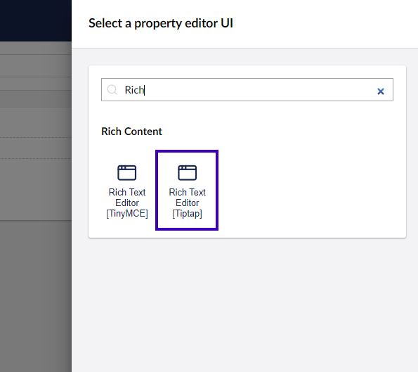
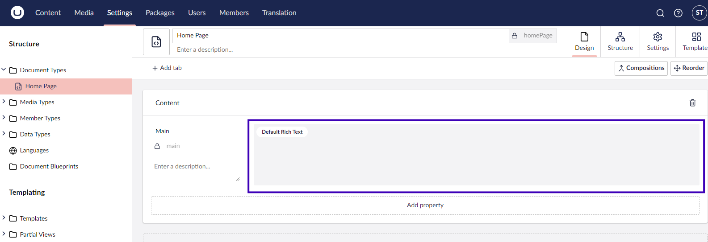
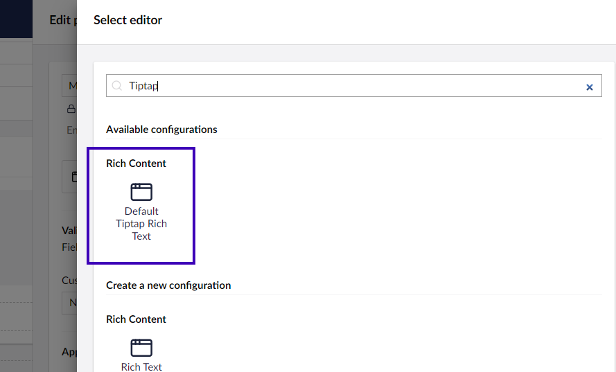

# Change Rich Text Editor UI


Umbraco 15 includes two options for rich text editing: Tiptap and TinyMCE. TinyMCE will eventually be phased out of the CMS.

This article will guide you through switching from TinyMCE UI to the new Tiptap UI.


The following steps will guide you through changing the property editor used for rich text on an existing Document Type.

## Create a new Data Type

The first step in this guide is to create a new Rich Text Editor Data Type using the Tiptap property editor.

As an alternative, you can create a new Data Type using the Tiptap property editor when updating the Document Type.


When swapping the UI used for the Rich Text Editor, you need to reconfigure the toolbar.


1. Navigate to the **Settings** section of the Umbraco Backoffice.
2. Select **+** next to the Data Types folder.
3. Select **New Data Type...**.

4. Give the new Data Type a name.
5. Click **Select a property editor**.
6. Choose **Rich Text Editor [Tiptap]**.

7. [Configure the Data Type](./configuration.md) to match your needs.
8. **Save** the Data Type.

## Update the Document Type(s)

Once you have prepared the new Data Type you need to update the Document Types that should use it.

1. Expand the **Document Types** folder.
2. Select a Document Type that needs to be updated.
3. Click on the Property used for rich text.

4. Hover over the selected property editor and click **Change**.
5. Search for the newly created Data Type and select it.

6. **Submit** the changes.
7. **Save** the Document Type.
8. Repeat steps 2-7 for each Document Type that needs to use the new Data Type.

## Verify your content

When you have updated all the relevant Document Types, it is recommended to verify the content that uses the Rich Text Editor.
