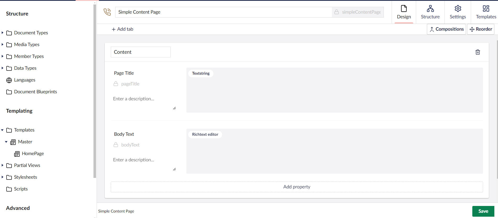
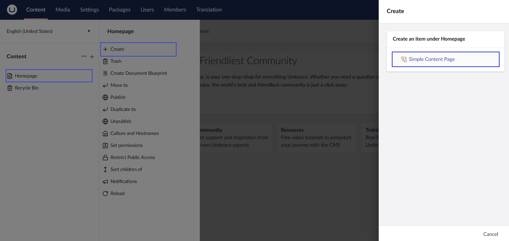
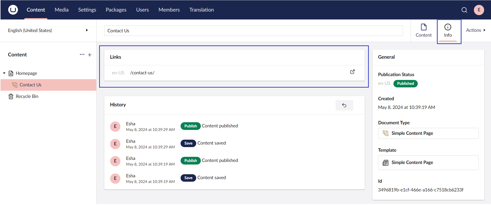

# Creating Pages and Using the Master Template

## Creating a Contact Us Page

We will now create a page to display our contact details. For added functionality, you might consider replacing this page with a fully-fledged "Contact Us" form.

Here are some potential solutions:

* **Use Umbraco Forms (for non-developers):** Umbraco offers an add-on called Umbraco Forms. This tool is ideal for users who aren’t programmers, as it allows editors to create custom forms. You can find more information and purchase the product on [Umbraco.com](https://umbraco.com/products/umbraco-forms/).
* **Build Your Own Contact Form (for developers):** If you prefer a custom solution, you can build your own contact form using [Surface Controllers](../../fundamentals/code/creating-forms.md) in Umbraco.

### Creating the Document Type and Template

To create a content-only contact page in Umbraco, follow these steps:

1. Go to **Settings**.
2. Click on **...** next to **Document Types**.
3. Select **Create**. The Create Document Type dialog opens.
4. Select **Document Type with Template**.
5. Select an **Icon** from the list of icons.
6. Click **Submit**.
7. Enter a **Name**. Let's call it _Simple Content Page_.
8.  Let's add two fields with the following specifications:

    | Group   | Field Name | Alias     | Data Type        |
    | ------- | ---------- | --------- | ---------------- |
    | Content | Page Title | pageTitle | Textstring       |
    | Content | Body Text  | bodyText  | Rich Text Editor |

    
9. Click **Save**.
10. Go to **Templates** to view your _Simple Content Page_ template that was created automatically with the Document Type.

    
    If you do not see the template, try refreshing the page.
    

11. Open the _Simple Content Page_ template.
12. Select `Master Template: No Master` and choose the **Master** template.
13. Click **Choose**.
14. Add the following HTML after the closing `}`.

    ```html
    <!-- Jumbotron, w title -->
        <div class="jumbotron text-center jumbotron-fluid">
                <div class="container">
                    <h1 class="display-1">Umbraco Support</h1>
                </div>
            </div>

    <!-- Main -->
    <section id="main" class="wrapper">
        <div class="container">

            <p>Are you a developer?</p>
            <p>Are you a marketer?</p>
            <p>Are you working at an agency?</p>
            <p>Let Umbraco unleash your talent</p>
        </div>
    </section>        
    ```
15. Click **Save**.

### Updating the Document Type Permissions

We now need to update the Document Type permissions to specifically add child nodes under the root content node.

To update the Document Type permissions:

1. Go to **Settings**.
2. Open the **Homepage** Document Type.
3. Go to the **Structure** tab.
4. Click **Choose** in the **Allowed child node types**.
5.  Select **Simple Content Page**.

    
6. Click **Choose**.
7. Click **Save**.

### Creating the content node

To create a content node:

1. Go to **Content**.
2. Select **...** next to the **Homepage** node.
3. Click **Create**.
4.  Select **Simple Content Page**.

    
5. Enter a name for the Document Type. Let's call it _Contact Us_.
6. Fill in details for the **Page Title** and **Body Text**.
7. Click **Save and Publish**.

### Adding the Document Type Properties

To add the Document Type properties:

1. Go to **Settings**.
2. Expand the **Templates** folder from the **Templating** section.
3. Go to **Master** and open the **Simple Content Page** template.
4. Scroll to the `<!-- Jumbotron, w title -->` (around line 7) section and highlight the text `“Umbraco Support”` (around line 10).
5. Click **Insert** and select **Value**.
   * Select **Document Type** from the **Choose field** drop-down list.
   * Select **Simple Content Page**.
   * Click **Choose**.
   * Select **pageTitle** from the **Simple Content Page** drop-down list.
   * Click **Submit**.
6. Repeat the same process for the `<div class="container">` tag:
   * Highlight the content from the `<p>` tag (around line 18) to the end of the `</p>` tag (around line 21).
   * Click **Insert** and select **Value**.
   * Select **Document Type** from the **Choose field** drop-down list.
   * Select **Simple Content Page**.
   * Click **Choose**.
   * Select **bodyText** from the **Simple Content Page** drop-down list.
   * Click **Submit**.
7. Click **Save**.

### Viewing the Contact Us Page

To view the **Contact Us** Page:

1. Go to **Content**.
2. Navigate to the **Contact Us** page.
3. Go to the **Info** tab.
4.  Click the link to view the page.

    

## Using Document Type Properties from the Homepage

You may notice that the footer is now empty - we don't have the content from our Homepage node.

To use the Document Type properties from the _Homepage_ Document Type, do the following:

1. Go to **Settings**.
2. Expand the **Templates** folder from the **Templating** section.
3. Open the **Master** template.
4. Highlight `@Model.Value("footerText")` in the footer (around line 51).
5. Click **Insert** and select **Value**.
6. Select **Document Type** from the **Choose field** drop-down list.
7. Select **Home Page**.
8. Click **Choose**.
9. Select **footerText** field from the **HomePage** drop-down list.
10. Select **Yes, make it recursive** checkbox. This notifies Umbraco to look up the content tree if the field doesn't exist at the node level for the page we're requesting.
11. Click **Submit**.
12. Click **Save**.

Reload the _Contact Us_ page to view the content with the footer.
