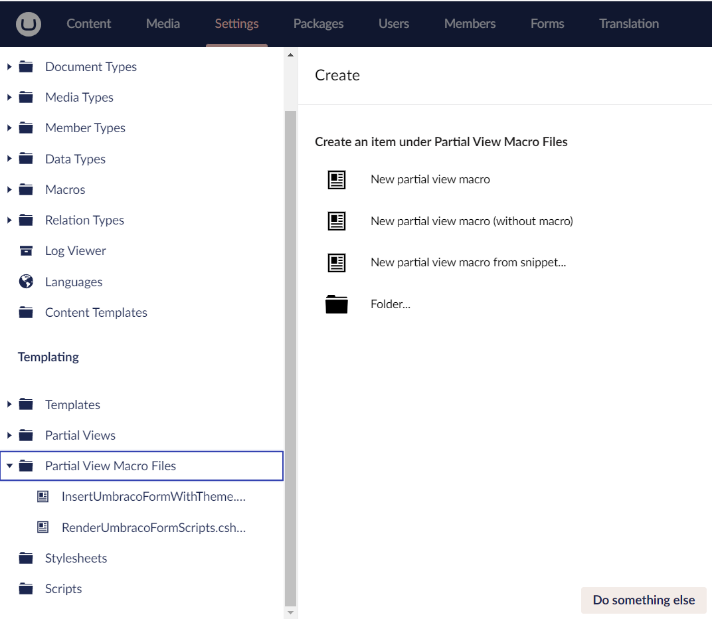
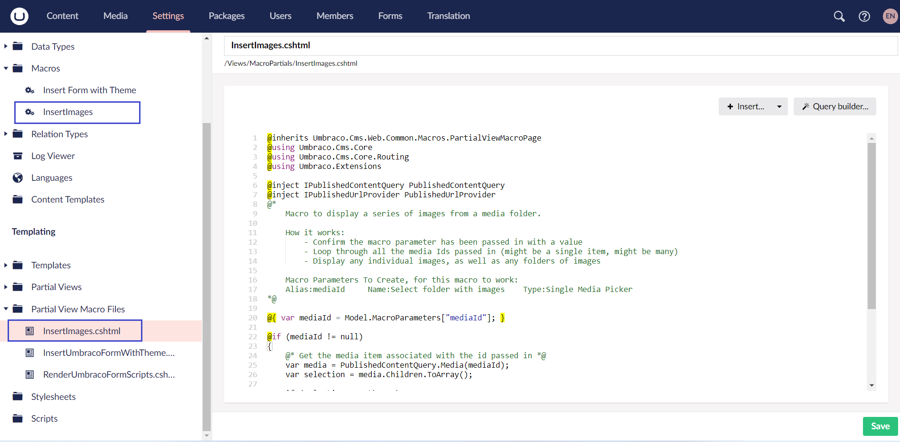
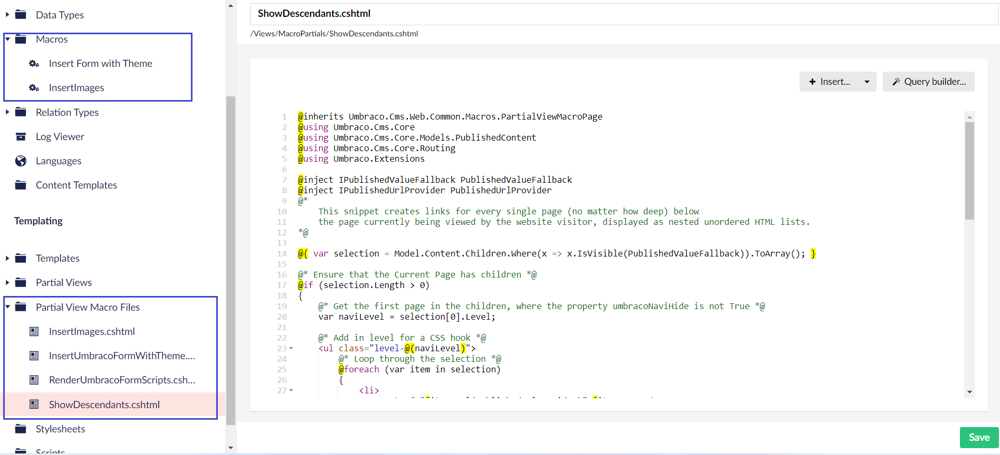
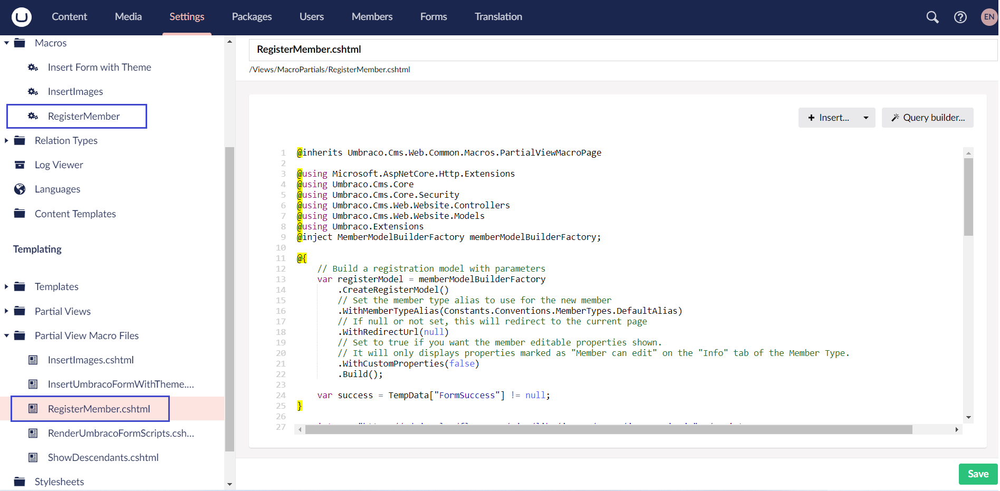
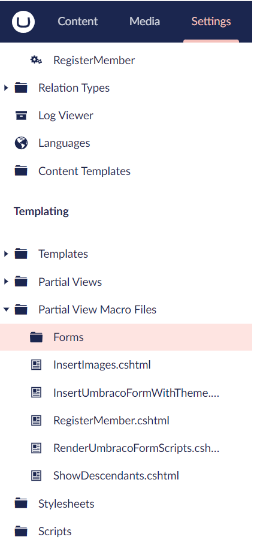

# Partial View Macro Files

A Macro is a reusable piece of functionality with some configuration options in the Backoffice. A Partial View Macro File (`.cshtml` file) is a specific file configuration that is associated with the Macro. A Partial View Macro File generates a Macro that can be inserted and rendered in the Grid and Rich Text Editor data types. Additionally, you can define parameter values and enable caching in Macros in the Backoffice. Partial View Macro Files are the recommended macro type to use in Umbraco.

## Partial View Macro Files in the Backoffice

You can create and edit Partial View Macro Files in the **Partial View Macro Files** folder from the **Settings** section of the Backoffice.



In the **Create** menu, there are four options available:

* New partial view macro
* New partial view macro (without macro)
* New partial view macro from snippet
* Folder (for keeping the partial view macro files organized)

## Creating a Partial View Macro File

To create a Partial View Macro File, go to the **Settings** section in the Umbraco backoffice and right-click the **Partial View Macro Files** folder. Choose **Create**. Select **New partial view macro** and enter a Partial View Macro File name. Enter the macro logic and click the **Save** button. You will now see the Partial View Macro File in the **Partial View Macro Files** folder and the macro in the **Macros** folder in the Backoffice.



By default, the Partial View Macro File is saved in the `Views/MacroPartials` folder.

## Creating a Partial View Macro File (without macro)

To create a Partial View Macro File without a macro, go to the **Settings** section in the Umbraco backoffice and right-click the **Partial View Macro Files** folder. Choose **Create**. Select **New partial view macro (without macro)** and enter a Partial View Macro File name. Enter the macro logic and click the **Save** button. You will now see *only* the Partial View Macro File in the **Partial View Macro Files** folder in the Backoffice.



By default, the Partial View Macro File is saved in the `Views/MacroPartials` folder.

## Creating a Partial View Macro File from Snippet

To create a Partial View Macro File from the snippet, go to the **Settings** section in the Umbraco backoffice and right-click the **Partial Views Macro Files** folder. Choose **Create**. Select **New empty partial view macro from snippet**. Select the snippet you want to create a partial view for and enter a Partial View Macro Filename. The code snippet you selected is displayed in the backoffice editor. Click the **Save** button. You will now see the Partial View Macro File in the **Partial View Macro Files** folder and the macro in the **Macros** folder in the Backoffice.



By default, the partial view is saved in the `Views/MacroPartials` folder.

## Creating a Folder

To create a folder, go to the **Settings** section in the Umbraco backoffice and right-click the **Partial Views Macro Files** folder. Choose **Create** and select **Folder**. Enter a folder name and click the **Create** button.



## Rendering a Partial View Macro File

To render the created Partial View Macro File in any template, use the `RenderMacroAsync` method:

```csharp
@await Umbraco.RenderMacroAsync("InsertImages")
```

### Related Articles

* [Macros](../../../Reference/Templating/Macros/index.md)
* [Managing Macros](../../../Reference/Templating/Macros/managing-macros.md)
* [Partial View Macros](../../../Reference/Templating/Macros/Partial-View-Macros/index.md)
* [Macro Parameter Editors](../../../Extending/Macro-Parameter-Editors/index.md)
