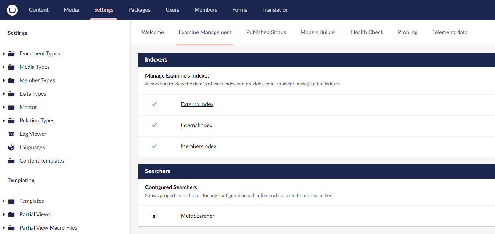

# Examine Management

_Provides an overview of the available Examine functionality available directly within the Umbraco backoffice_

## Overview

The Umbraco backoffice allows you to view details about your Examine indexes and searchers - all in one place. You can see which fields are being indexed, rebuild the indexes if there's a problem, and test keywords to see what results would be returned.

The Examine Management section, accessible from within the Settings section, is split into two sections: Indexers and Searchers.

## Indexers

From the Indexers section, you can view details about each Examine index currently configured within your Umbraco installation. Clicking any of these indexes will show you additional options, each discussed below.

### Index info

This section allows you to see the list of properties on the index that you selected, including how many documents and fields are currently being stored.

Within the Indexers it displays the details for the index provider as well.

This can be useful to confirm the configuration that Umbraco is using and to ensure it is working as expected. This section also displays the full file path of the index itself.

This section also provides the ability to rebuild the index, should this be required. Depending on how much content your website has, rebuilding the search indexes could take a while and affect the site performance temporarily, so it is not recommended to do this while the website is under high load.

### Fields

From here you can see the default system fields that are stored for each document within the search index. That includes the number of fields document, and the score which is calculated by Examine depending on how closely the individual results matched the search term.

## Searchers

The Searchers section is broken down into two sub-sections which provide configuration details along with the ability to test how a search index is currently performing.

### Search tools

The search tools allows you to enter a search term and receive results back from the searcher in question, to confirm it is working as expected. Search terms can be entered either as plain text or as a lucene query. Matching results are returned in their raw format, with the score, document ID and values being returned. The score is calculated by Examine depending on how closely the individual results matched the search term.
