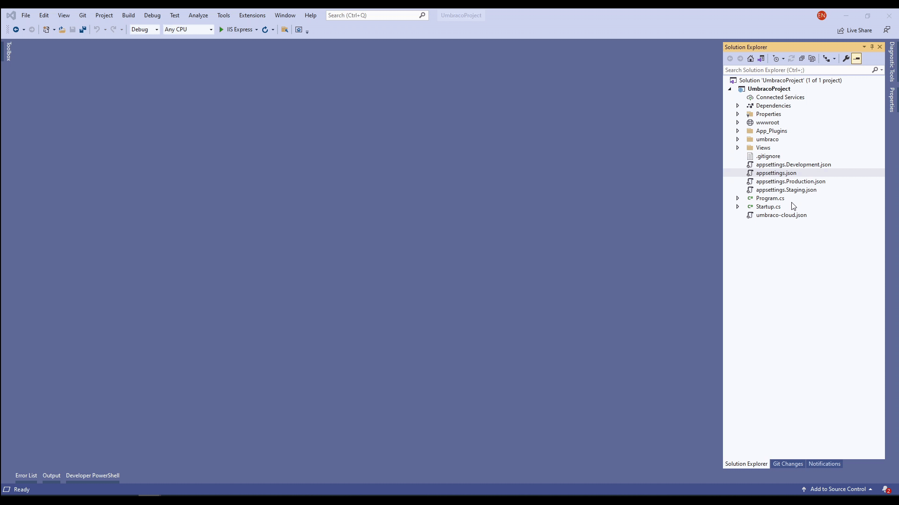

# SMTP Settings on Umbraco Cloud

In many cases, you might want to send emails from your Umbraco Cloud project. It could be for inviting users to the Backoffice or as part of an Umbraco Forms Workflow. To do so, you will need to have an Simple Mail Transfer Protocol (SMTP) server and configure this in your `appsettings.json` file.

SMTP server is not included with your Umbraco Cloud project. You will need to have your own SMTP server setup elsewhere and then you need to configure this service with your Umbraco Cloud project.

## Why Configure SMTP?

There are a handful of reasons where configuring an SMTP service on your Umbraco Cloud project could come in handy - or might even be necessary.

### Umbraco Forms

When you are working with Umbraco Forms, you have the option to setup email workflows. This enables you to create forms that send out emails - it could be a contact form where your customers can send emails directly to you.

To setup an email workflow to send out emails, you will need to configure the SMTP service. In some cases, you might also experience that you need to configure a *SenderEmail* for notifications.

Configure *SenderEmail* in the `appsettings.json` file under `Umbraco:CMS:Global:Smtp`. Find more details, see the [`Send Email`](../../../Add-ons/UmbracoForms/Editor/Attaching-Workflows/Workflow-Types/index.md#send-email) section of the [Workflow Types](../../../Add-ons/UmbracoForms/Editor/Attaching-Workflows/Workflow-Types/index.md#) article.

```csharp
 "Umbraco": {
    "CMS": {
        "Global": {
            "Smtp": {
                "From":  "person@umbraco.dk"
            }
        }
    }
},
```

### Backoffice Users

There are two scenarios for Backoffice users where configuring an SMTP service is needed:

1. When you want to add a user to your project directly from the Backoffice. Doing this involves sending out an email to the new user. For this particular scenario we've setup a fallback, which means that even though you haven't yet configured an SMTP service, an email will still be sent to the new user. Keep in mind that the fallback is **only** for this particular purpose; inviting users to join your project.

2. To setup the SMTP service for your Umbraco Cloud project if one of your Backoffice users have forgotten their password. To reset their password, they have to request a password reset which will be send to them by mail. This will only work once you've configured an SMTP service.

:::note
By default, the option to request password resets for Backoffice Users is disabled on Umbraco Cloud projects. This is mainly to ensure that your Backoffice login stays in sync with your Umbraco ID.
:::

You can reset your Umbraco ID password from the Umbraco Cloud login page. Find more details about Umbraco ID in the ['Users on Cloud'](../Users-On-Cloud) article.


## Configure SMTP Settings

As Umbraco Cloud doesn't provide SMTP servers, you will need to find hosting elsewhere. There are multiple excellent services out there, here's a few we know work with Umbraco Cloud:

* [Sparkpost](https://www.sparkpost.com/) - quick to setup and developer-friendly
* [SendGrid](https://sendgrid.com/) - quick to setup
* [MailGun](https://www.mailgun.com/) - mainly for developers, as it is a bit more on the technical side
* [Rapidmail](https://www.rapidmail.com/) - EU based and GDPR compliant

<iframe width="800" height="450" src="https://www.youtube.com/embed/CFYuF7eNTF4?rel=0" frameborder="0" allow="autoplay; encrypted-media" allowfullscreen></iframe>

Step 1 - Set up the SMTP server.

Step 2 - Configure the service in your `appsettings.json` file - in the `Umbraco:CMS:Global:Smtp` section.

```csharp
"Umbraco": {
    "CMS": {
        "Global": {
            "Smtp": {
                "From": "person@umbraco.dk",
                "Host": "127.0.0.0",
                "Username": "person@umbraco.dk",
                "Password":  "password123"      
            }
         }
    }
},
```



To configure your SMTP service, enter the following details:

* **Host**: IP address or hostname for your SMTP service
* **Username**: Your username for the SMTP service
* **Password**: The password you use to access your SMTP service

When you've configured these settings for your SMTP service, you will be able to send emails from your Umbraco Cloud project.

:::note
You can test if you've configured your SMTP service correctly by running a [Health Check](https://our.umbraco.com/Documentation/Extending/Healthcheck/) from the Umbraco Backoffice.
:::
