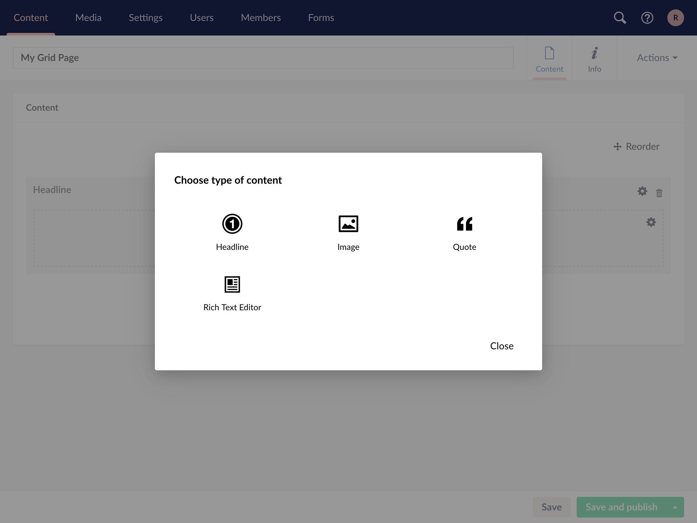
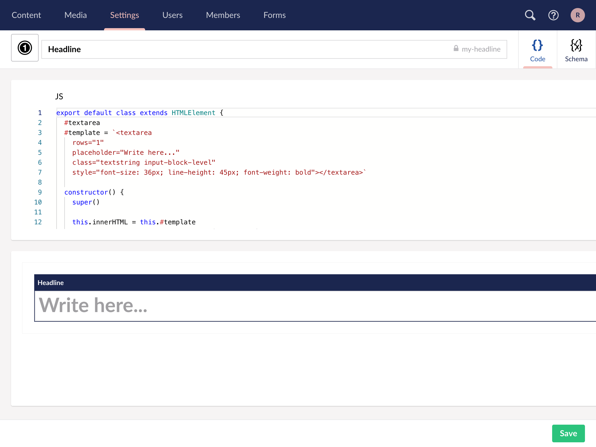
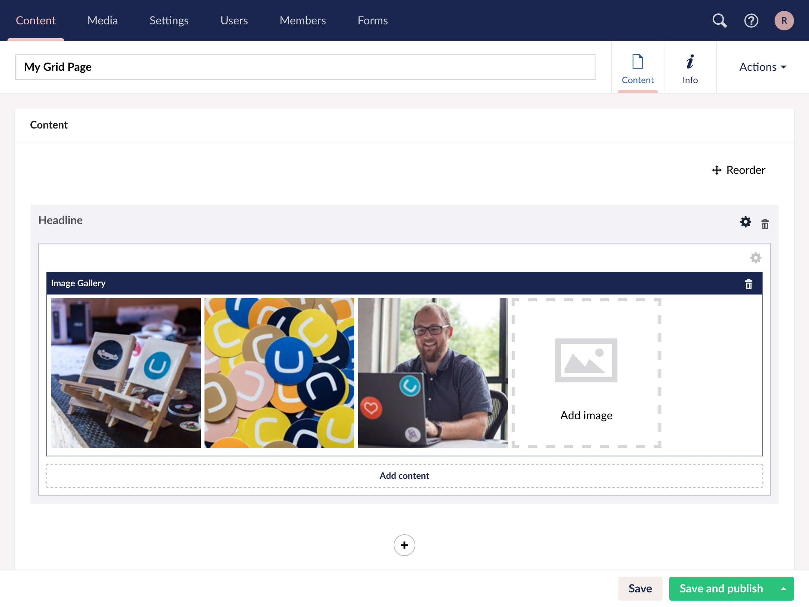
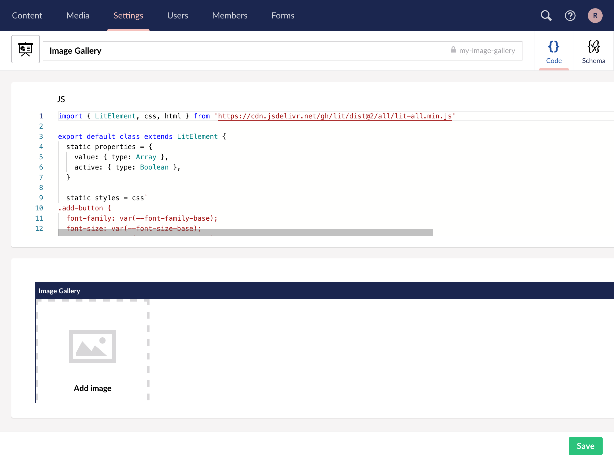

# Custom Grid Editors in Umbraco Heartcore

In this tutorial, we will create a Custom Grid Editor using [custom elements](https://developer.mozilla.org/en-US/docs/Web/Web_Components/Using_custom_elements) and [Lit](https://lit.dev/). We will look at how we can define what the API response for our data should look like.

## Content

* [Create a Document Type and Grid configuration](#create-a-document-type-and-grid-configuration)
* [A look at a default grid editor](#a-look-at-a-default-grid-editor)
* [Create a custom grid editor](#create-a-custom-grid-editor)
* [Using module aliases](#using-module-aliases)
* [Describing the grid editor using JSON schema](#describing-the-grid-editor-using-json-schema)

## Create a Document Type and grid configuration

First, we will need to create a Document Type containing the Grid Layout property editor.

* Go to the **Settings** section.
* Create a new Document Type called **Grid Page**.
* Add a new property called **Grid Content**.
* Select the **Grid layout** editor.
* Accept the default configuration.


The Document Type should now look like this:


To allow the Document Type to be created in the tree we need to change the permissions:

* Select the **Permissions** tab.
* Ensure **Allow as root** is checked.


To verify the configuration follow these steps:

* Go to the **Content** section.
* Create a new page based on the **Grid Page** Document Type we created.
* Give it a name.
* Save the page.


Try choosing a layout, add a row and click **Add content**. Here we will see that we have a couple of editors to choose from.



Try adding one of them to the page to see how they work.

## A look at a default grid editor

Before we start writing our own Grid Editor, let's have a look at the **Headline** Grid Editor.



As we can see the page is divided into two sections; one with a Text Editor with the code for the editor and one with a preview of the editor.

Let's take a look at the code.

A custom editor inherits from `HTMLElement` and must be the default export.

```javascript
export default class extends HTMLElement {
```

A couple of [private fields](https://developer.mozilla.org/en-US/docs/Web/JavaScript/Reference/Classes/Private_class_fields) are defined. One for storing a reference to the `textarea` field and one for the HTML template.

```javascript
  #textarea
  #template = `<textarea
    rows="1"
    placeholder="Write here..."
    class="textstring input-block-level"
    style="font-size: 36px; line-height: 45px; font-weight: bold"></textarea>`
```

In the constructor we set the inner HTML of our custom element to our template and set the `#textarea` field to a reference to the textarea.

```javascript
  constructor() {
    super()

    this.innerHTML = this.#template
    this.#textarea = this.querySelector('textarea')
  }
```

The `click` method is called when the grid control is clicked. In this case we use it to set focus on the textarea.

```javascript
  click() {
    this.#textarea.focus()
  }
```

A `value` property is needed for the value to be stored when a page is saved and to set the value when the editor is loaded.

In this example the value property is setting and returning the value of the textarea.

```javascript
  get value() { return this.#textarea.value }
  set value(value) {
    this.#textarea.value = value || ''
  }
}
```

## Create a custom grid editor

For this tutorial we will create an image gallery editor using [Lit](https://lit.dev). Lit builds on top of the Web Components standards and helps us avoid a lot of boilerplate code.



* Go to the **Settings** section.
* Create a new **Grid Editor**.
* Choose an icon.
* Name it **Image Gallery**.
* Change the alias to `my-image-gallery`.

:::note
The alias is used as the custom element tag name and must be unique. By choosing a prefix that is less likely to used by any other HTML element, in this case `my-`, there is less chance for running into conflicts.
:::


In the `JS` view we can see there is already some boilerplate code. Let's replace it with the following:

```javascript
import { LitElement, css, html } from 'https://cdn.jsdelivr.net/gh/lit/dist@2/all/lit-all.min.js'

export default class extends LitElement {
  static properties = {
    value: { type: Array },
  }

  static styles = css`
.container {
  display: grid;
  grid-gap: 5px;
  grid-template-columns: repeat(auto-fit, 200px);
  padding: 5px;
}
.add-button {
  font-family: var(--font-family-base);
  font-size: var(--font-size-base);
  line-height: var(--line-height-base);
  cursor: pointer;
  width: 200px;
  height: 200px;
  padding: 20px;
  padding-bottom: 30px;
  background-color: var(--color-white);
  border: 4px dashed var(--color-gray-8);
  text-align: center;
  box-sizing: border-box;
}
.add-button svg {
  display: block;
  fill: var(--color-gray-8);
  font-size: 85px;
  line-height: 1;
  display: inline-block;
  height: 1.15em;
  width: 1.15em;
  margin: 10px auto;
}
.add-button div {
  color: var(--color-black);
  font-size: 14px;
  font-weight: 700;
}
`

  render() {
    return html`<div class="container">
      <button class="add-button">
        <svg xmlns="http://www.w3.org/2000/svg" viewBox="0 0 512 512">
          <path d="M246.486 299.31l-85.604-91.047-58.21 107.66v29.658h289.12c-36.821-31.753-114.476-99.682-114.476-99.682l-30.83 53.411zM347 230.786c16.062 0 29.073-13 29.073-29.06 0-16.04-13.012-29.062-29.073-29.062-16.019 0-29.038 13.021-29.038 29.062 0 16.06 13.019 29.06 29.038 29.06zM37.74 102.699v306.569h434.688V102.699H37.74zm396.082 267.916H77.635l-.016-228.033h354.928v.017h1.275v228.016z"></path>
        </svg>
        <div>Add image</div>
      </button>
    </div>`
  }
}

```

The preview should now look like this:



Let's break down the code.

```javascript
import { LitElement, css, html } from 'https://cdn.jsdelivr.net/gh/lit/dist@2/all/lit-all.min.js'
```

Here we're importing `LitElement`, CSS and HTML from the Lit library.

```javascript
export default class extends LitElement {
```

We're exporting a default class inheriting from `LitElement`.


```javascript
  static properties = {
    value: { type: Array },
  }
```

We tell Lit that we have a `value` property which we expect to be an `Array`.

```javascript
  static styles = css`
.container {
  display: grid;
  grid-gap: 5px;
  grid-template-columns: repeat(auto-fit, 200px);
  padding: 5px;
}
.add-button {
  font-family: var(--font-family-base);
  font-size: var(--font-size-base);
  line-height: var(--line-height-base);
  cursor: pointer;
  width: 200px;
  height: 200px;
  padding: 20px;
  padding-bottom: 30px;
  background-color: var(--color-white);
  border: 4px dashed var(--color-gray-8);
  text-align: center;
  box-sizing: border-box;
}
.add-button svg {
  display: block;
  fill: var(--color-gray-8);
  font-size: 85px;
  line-height: 1;
  display: inline-block;
  height: 1.15em;
  width: 1.15em;
  margin: 10px auto;
}
.add-button div {
  color: var(--color-black);
  font-size: 14px;
  font-weight: 700;
}
```

We define the styles in a static field called `styles`. This will make Lit automatically inject a stylesheet into our custom element. The text returned needs to use the `css` tag from `Lit`. For more info see the [Lit styles documentation](https://lit.dev/docs/components/styles/).


```javascript
  render() {
    return html`<div class="container">
      <button class="add-button">
        <svg xmlns="http://www.w3.org/2000/svg" viewBox="0 0 512 512">
          <path d="M246.486 299.31l-85.604-91.047-58.21 107.66v29.658h289.12c-36.821-31.753-114.476-99.682-114.476-99.682l-30.83 53.411zM347 230.786c16.062 0 29.073-13 29.073-29.06 0-16.04-13.012-29.062-29.073-29.062-16.019 0-29.038 13.021-29.038 29.062 0 16.06 13.019 29.06 29.038 29.06zM37.74 102.699v306.569h434.688V102.699H37.74zm396.082 267.916H77.635l-.016-228.033h354.928v.017h1.275v228.016z"></path>
        </svg>
        <div>Add image</div>
      </button>
    </div>`
  }
}

```

The render method returns the HTML we want to show. It needs to be tagged with `html`. For more info see the [Lit templates documentation](https://lit.dev/docs/templates/overview/).

Let's save the editor and see how it looks when adding it to the a content item.


We now have the **Add image** button rendering, but clicking it does nothing. Let's do something about that.

* Go back to the **Settings** section.
* Click on the **Image Gallery** Grid Editor.

We will start by adding the following to the top of the file:

```javascript
import { mediaPicker } from 'https://cdn.jsdelivr.net/npm/@umbraco/headless-backoffice-bridge@0/headless-backoffice-bridge.min.js'
```

This imports the `mediaPicker` function from the [backoffice bridge](https://github.com/umbraco/Umbraco.Headless.Backoffice.Bridge) library.

We will add another function before the `render` function:

```javascript
showPicker() {
  mediaPicker.show({
    disableFolderSelect: true,
    onlyImages: true,
    showDetails: true,
    submit: (items) => {
      const selected = items[0]
      if(!this.value) this.value = []
      this.value.push(({ url: selected.udi, ...selected }))
      this.requestUpdate('value')
    }
  })
}
```

This will open the Media Picker with a configuration that only allows selecting images and showing the detail view, which allows us to enter an alt text, caption and choose a focal point.

The submit callback is called when the **Submit** is clicked. It will contain an array of the selected items. In this case it will contain a single item, but if we set `multiple` to `true` multiple items can be returned.

In our callback method we check if `this.value` has been initialized. If it has not we initialize a new array. We then push the selected image to the array. Note that we also store the `udi` (the id of the media) in a `url` property. We will come back to why we do that later.

Since we add to the array and do not set the `value` property we need to tell Lit that the property was updated. We do this by calling `this.requestUpdate('value')`.

We will also need to add a `click` event to the button so it will show the dialog:

```html
<button type="button" class="btn-reset placeholder" @click=${() => this.showPicker()}>
```

:::note
Clicking the button in preview mode does nothing. This is because of a limitation when previewing where we do not have access to the full backoffice. Saving and testing on a Content item should work.
:::

* Click **Save**.
* Go back to the content page.
* Click the `Add image` button.

We should now see the image overlay.


Selecting an image does not currently render anything. Let's do something about that. Go back to the grid editor code in the **Settings** section.

Update the `render()` function with the following

```javascript
render() {
  const items = this.value || []

  return html`<div class="container">
    ${items.map(image => html`<umbh-image width="200" height="200" udi=${image.udi} alt=${image.altText} .focalPoint=${image.focalPoint}></umbh-image>`)}
    <button class="add-button" @click=${() => this.showPicker()}>
      <svg xmlns="http://www.w3.org/2000/svg" viewBox="0 0 512 512">
        <path d="M246.486 299.31l-85.604-91.047-58.21 107.66v29.658h289.12c-36.821-31.753-114.476-99.682-114.476-99.682l-30.83 53.411zM347 230.786c16.062 0 29.073-13 29.073-29.06 0-16.04-13.012-29.062-29.073-29.062-16.019 0-29.038 13.021-29.038 29.062 0 16.06 13.019 29.06 29.038 29.06zM37.74 102.699v306.569h434.688V102.699H37.74zm396.082 267.916H77.635l-.016-228.033h354.928v.017h1.275v228.016z"></path>
      </svg>
      <div>Add image</div>
    </button>
  </div>`
}
```

We assign the editor value to a local variable `items`, if `this.value` is `null` or `undefined` we assign an empty array.
Then in the HTML we are now looping over the items and returning an `umbh-image` for each item. `umbh-image` is a custom element included with the backoffice bridge, it takes an `udi` and renders an images based on that.

Go back to the **Content** section try to add some images to a page using the editor.

We now have an editor that we can add images to which gets rendered in the backoffice. Next step would be to add edit and delete functionality, but we will leave that to the reader.

## Using module aliases

Up until now we have been using the full URL when importing third party modules into our editors. While this works fine most of the time, we will most likely run into issues when importing libraries that registers custom elements. This is because custom elements needs to be registered using an HTML tag and a tag can only be registered once.

Imagine we have an editor using custom elements from a third party library. We then create another editor using the same library but in a newer version which adds some new functionality to the custom element we use.

One of two things will happen:

1. The library checks if a custom element with the same name has already been registered and skips registration. This will leave us not knowing which version is used and might break our implementation.
2. It will try to register the element with the same name but fail because there is already an element registered with the same name.

In either case we will end up with a broken editor experience. This is where module aliases comes in.

Module aliases allows us to define a common name for a module that we can use in our editors instead of the full URL. A module alias can be defined by going to the **Headless -> Custom Editor Configuration** page in the **Settings** section.


Here we have defined an alias `@headless-backoffice-bridge` pointing to a CDN URL of the [backoffice bridge library](https://github.com/umbraco/Umbraco.Headless.Backoffice.Bridge).

With this alias added we can update our import in our editor to:

```javascript
import { mediaPicker } from '@headless-backoffice-bridge'
```

The alias will automatically be replaced with the URL we have defined, similar to how `node` does.

By using the same alias in all our editors, we can ensure that only one version of the library is loaded. If we want to upgrade to a newer version, we will only need to update the URL in one place.

## Describing the grid editor using JSON schema

Now that we have a working editor, let's add a couple of images to our page. When done, click **Save and publish**.

Note down the **Id** from the **Info** tab. We will need that in a bit.

* Go to the **Settings** section.
* Exapnd the **Headless** node.
* Open the [API Browser](../../Getting-Started-Cloud/API-Browser/)
* Type in `https://cdn.umbraco.io/content/<CONTENT_ID>` in the Explorer URL bar, replacing `<CONTENT-ID>` with the id we copied before.
* Click **Go!**.

In the output we can see the JSON we have stored in the editor.


Notice our value stored is returned as a `string`. This makes it hard to consume, since we will need to parse it as JSON everywhere we use that value. This is where [JSON schemas](https://json-schema.org/) comes in handy.

Let's go back to our Grid Editor implementation and see what we can do.

Looking at the default JSON schema we can see that the type is set to `string`. This tells Heartcore that our editor is returning its data as a `string`. This is what we saw before in the API response. Since we are storing an array of images, let's change the `type` to `array`. We also need to specify what the array is containing. We do that by adding an `items` property containing a `type: object` property.

* Change the `type` from `string` to `array`
* Add an `items` property containing a `type: object` property.

The schema should now look like this:

```json
{
    "$schema": "https://json-schema.org/draft/2020-12/schema",
    "type": "array",
    "items": {
        "type": "object"
    }
}
```

Let's go back to the API Browser, type the same URL as before and click **Go!**.

Inspecting the output, we can already see an improvement. The value is now returned as an array which is already much better.


Remember the `url` property stored earlier? Let's make it return a URL instead of a UDI.

* Go back to the Grid Editor schema.
* Update it to the following:

```json
{
    "$schema": "https://json-schema.org/draft/2020-12/schema",
    "type": "array",
    "items": {
        "type": "object",
        "properties": {
            "url": { "type": "string", "format": "uri-reference" }
        }
    }
}
```


With the JSON above we are adding a `properties` object containing a `url` property. This property has its `type` set to `string`, and most importantly, `format` set to `uri-reference`. By specifying the `format` as `uri-reference` Heartcore will try to parse the value as a UDI and if the UDI is for either a document or media, the URL of that item will be returned instead. We can see that if we go back to the API Browser.


We now have an array where each item has the URL to the picked media item.

:::note
While it is not necessary to define all properties in the JSON Schema, it is highly recommended as the schema is also used for validating the editor data when saving.
:::

Besides the `uri-reference` format there's also `rich-text`. This is useful when storing rich text data like the output from the TinyMCE editor. When specifying the `rich-text` format, things like `{locallink}` and `data-uri` will automatically be replaced with the correct URLs.

:::links
## Related articles
- [Custom Grid Editors](../../Backoffice/Grid-Editors/)
:::

