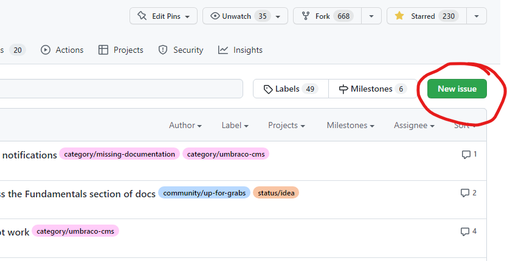

# Submit Feedback

There are a couple of different ways to submit feedback on the documentation, be it the entire platform or a single article. This article will give you an overview of the different feedback channels and how to use them.

## Submit feedback for articles

At the right side of each article in our documentation, you have the option to provide feedback for the content.

<figure><figcaption>
Feedback Option.
</figcaption></figure>

You can rate the content from one to five stars.

<figure><figcaption></figcaption></figure>

Once you have selected the number of stars, you can write feedback for the page.

<figure><figcaption>
Written feedback.
</figcaption></figure>

&#x20;Clicking the small square in the feedback window, you can select an element on the page that you want to highlight with your feedback.

<figure><figcaption>
Select element on page to give feedback on.
</figcaption></figure>

<figure><figcaption>
Selected element.
</figcaption></figure>


We highly recommend that you share feedback on the articles you come across. This will help us provide better material across the line.

The feedback is used when determining which articles need to be reviewed by the documentation team at Umbraco HQ.


## Submit a GitHub Issue

The [Issue Tracker](https://github.com/umbraco/UmbracoDocs/issues) is a way to keep track of ideas, issues with wrong or outdated documentation, and discussions with other contributors.

Here are a few examples of what the Issue Tracker can be used for:

* You were looking for a specific piece of information, but couldn't find it.
* You found a broken link in one of the articles.
* You found an article with wrong or outdated information and you do not have the time or knowledge to rewrite it.
* You want to discuss possible improvements or ways to deal with a specific thing in the documentation.

### Creating an Issue

You can add issues directly from the [Issue Tracker on GitHub](https://github.com/umbraco/UmbracoDocs/issues).

We have set up a template that we recommend using when creating an Issue on the tracker. The template gives you a few questions to answer, to help you give the best explanation of what you are reporting or want to discuss.
