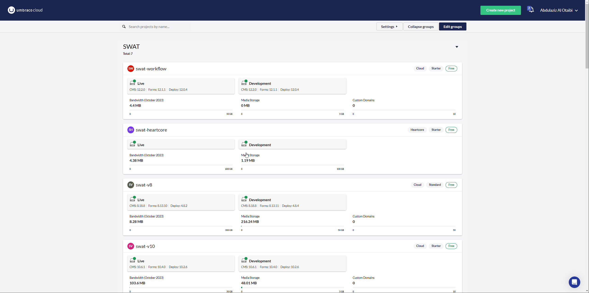

# Deployment Webhook

You can now configure a deployment webhook to be triggered upon successful deployments to any of your Umbraco Cloud environments. For example, when deploying from your local environment to one of your Cloud environments. Upon successful deployment, general information about the deployment will be posted in a JSON format to the specific URL you have configured.

## Use cases

There are many use cases for deployment webhooks such as providing a detailed audit trail. Here are some scenarios where webhooks could be useful:

1. Any deployments to the Live site could be relevant for many parties in a company. Posting information about a deployment in internal communication channels like Slack is made possible using this feature.
2. Monitoring of the whole deployment cycle. A successful deployment might cause an error to show on the website. Integrating the webhook with other monitoring services, you could find out which deployment caused the issue.
3. Letting content editors know about particular deployments such as when a new Document Type was added. Will inform them that they can now use the new Document Type.

## How to set up a webhook



1. From the Umbraco Cloud Portal go to **Settings** -> **Webhooks**
2. Select the environment to register a webhook.
3. Fill in the **Webhook URL** to which the data about a deployment should be posted to. An absolute URL with HTTP/HTTPS schema is an acceptable input to the field - ex. `https://exampleURL.com`
4. Click **Add Webhook**.

## Sample data

General information about the deployment (to the configured environment) will be posted in JSON format to the URL (configured in the previous section).

### Headers

The headers contain information about the payload in JSON format as well as a version of the payload.

```json
X-Umb-Webhook-Version: 1
Content-Type: application/json; charset=utf-8
```

### Contents

Contents of the payload contain general information about the current deployment with links to the project in the Portal and the frontend of the environment. The final section lists deployed commits, including author, commit message, and changed files in the environment.

```json
{
    "Id": "40810bf1bbbfc16dd273162509de297ad386fb4e",
    "Status": "success",
    "StatusText": "",
    "AuthorEmail": "laughingunicorn@example.com",
    "Author": "Laughing Unicorn",
    "Message": "Adding document type 'LaughingUnicornLaughs'",
    "Progress": "",
    "ReceivedTime": "2017-10-02T11:19:00.4984213Z",
    "StartTime": "2017-10-02T11:19:04.1328336Z",
    "EndTime": "2017-10-02T11:19:24.3470224Z",
    "LastSuccessEndTime": "2017-10-02T11:19:24.3470224Z",
    "Complete": true,
    "ProjectName": "laughingUnicorn",
    "ProjectUrl": "s1.umbraco.io/project/laughingunicorn",
    "SiteUrl": "laughingunicorn.s1.umbraco.io",
    "EnvironmentName": "Live",
    "Commits": [
        {
            "AuthorName": "Laughing Unicorn",
            "AuthorEmail": "laughingunicorn@example.com",
            "Message": "Adding document-type 'LaughingUnicornLaughs'\n",
            "Timestamp": "2017-10-02T07:16:39",
            "ChangedFiles": [
                "data\\revision\\document-type__9ac71ecba6d84344af4bcbf43ab6cd80.uda"
            ]
        },
        {
            "AuthorName": "Laughing Unicorn",
            "AuthorEmail": "laughingunicorn@example.com",
            "Message": "Adding template 'LaughingUnicornLaughs'\n",
            "Timestamp": "2017-10-02T07:16:38",
            "ChangedFiles": [
                "Views\\laughingunicornlaughs.cshtml",
                "data\\revision\\template__80d64e8172df46479ccf330bb9f63f2c.uda"
            ]
        }
    ]
}
```
