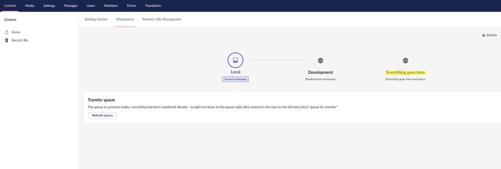

# Deployment

Umbraco Cloud uses a deployment model based on Git, Kudu, and Umbraco Deploy to move changes between environments. This follows a left-to-right deployment approach. Changes start in the local or left-most environment and are deployed to the production/Live environment. This workflow is called the mainline.

The mainline environments are used when building and deploying the initial website. Upgrades, both manual and automatic also go through the mainline environments.

Flexible environments can be used to work on features separate from the mainline. This is done without interfering with upgrades or other changes being worked on in the mainline.

## Deployment Approach

Umbraco Cloud separates schema and content during deployment. Schema includes Document Types, Templates, Forms, Views, and config files. Content includes content items and media.

* **Deploy:** Moves schema between environments using a Git client or the Umbraco Cloud Portal.
* **Transfer:** Move content and media directly via the Umbraco backoffice.

### Types of Deployments

| Schema Deployments | Content and Media Transfers |
| ----------- | ------------- |
| Schema is stored in a Git repository. These are **deployed** between environments using a Git client or the Umbraco Cloud Portal. | Content and Media items are not stored in the Git repository. They must be **transferred** directly from the Umbraco backoffice using the **Queue for Transfer** option. Once queued, use the **Deployment** Dashboard in the **Content** section to complete the transfer. |

Content editors do not need Umbraco Cloud Portal access. They can manage content through the backoffice, while developers handle schema deployments via Git.

### Deploying Schema

The source and target environments must be in sync before transferring content and media. Deploy schema first to ensure consistency.

* [Deploy changes from Local to Cloud](local-to-cloud.md)
* [Deploy changes between Cloud environments](cloud-to-cloud.md)
* [Umbraco Forms on Cloud](umbraco-forms-on-cloud.md)

### Transfer Content and Media

Content and media move between environments through the Umbraco backoffice. Content can be transferred from Local to Development and restored from Live or Staging.

* [Transfer Content and Media](content-transfer.md)
* [Restore Content and Media](restoring-content/)


The transfer and restore process is the same for Local to Cloud and between Cloud environments.


## [Deploy Settings](https://docs.umbraco.com/umbraco-deploy/deploy-settings)

All configuration for Umbraco Deploy is stored in the `appSettings.json` file found at the root of your Umbraco website.

## Environment Restart

Some deployments can trigger an Umbraco Cloud environment to restart. The table below outlines which actions initiate a restart.

| Action:                             | Application Restart? |
| ----------------------------------- | -------------------- |
| Config file change                  | Yes                  |
| Schema deployment                   | No                   |
| File change (for example, CSS file) | No                   |
| Content or Media transfer           | No                   |

### Manual Restart

From the Umbraco Cloud Portal, you can manually restart your environments.

<figure><figcaption>
Restart an environment
</figcaption></figure>

## Umbraco-cloud.json

The `umbraco-cloud.json` file defines deployment settings, identifies the current environment, and determines the next deployment target.


The `name` attribute in the `umbraco-cloud.json` can be updated to clarify deployment destinations in the Workspaces dashboard.


***
