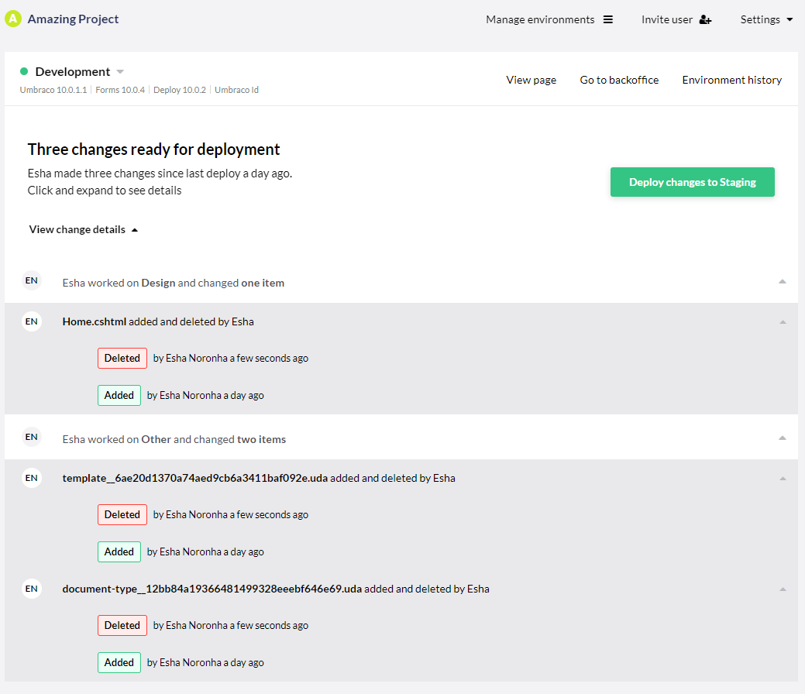

# Deploying Deletions

On Umbraco Cloud, deletions are environment specific. To delete something entirely from your project, you need to delete it in all environments.

In this article, you can read about the correct way of deleting files, schema, and content from your Umbraco Cloud project.

When you have an Umbraco Cloud project, you might have couple of environments including a local clone of the project. Each of these environments have their own database. These databases store references to your content, media, and schema files, such as Document Types and Templates.

The databases are environment specific. During deployment across environments, Umbraco Cloud's engine compares schema files with database references using *alias* and *GUID* for accuracy. If something doesn't add up, for example, there is a mismatch between the database references and the files deployed, you will see an error. Learn more about this in the [Troubleshooting section](../troubleshooting/deployments).

The workflow described above does not recognize deletions of content and schema from the database. You'll need to delete the content and/or schema on all your environments to fully complete the deletion.

The main reason we do not delete schema and content on deployments is that it could lead to an unrecoverable loss of data. Imagine you delete a Document Type in your Development environment. Then, push this deletion to your Live environment, where many content nodes depend on the deleted Document Type. When the deployments go through, all those content nodes would be instantly removed. There is no option to roll back because the Document Type they rely on no longer exists. To prevent such situations, manual deletion is necessary. You must actively decide on each environment for the process to occur.

## Example scenario

Let's say you've deleted a Document Type on your Development environment. Now, you want to deploy this deletion to the Live environment, along with some other changes you've made.

Before you deploy the changes, the Development environment will show that the following changes are ready to be deployed:

Following the **Activity log** in the browser, you'll notice the UDA file for the Document Type gets deleted. Additionally, other files with changes are copied to the new environment.

Once the deployment is completed, you will notice the following:

* The template is correctly updated
* The Document Type you deleted on Development is still present in the backoffice on the Live environment

You might wonder why the Document Type that you have deleted, is still there. The reason is, that we only delete the associated UDA file and not the actual Document Type in the database.

To delete the Document Type from your entire project, you need to delete it from the backoffice of the other environments. When the Document Type has been deleted from the Backoffice of all the environments and no UDA file exists, you can consider it gone.

You should keep in mind that if you save your Document Type during the process, a UDA file is regenerated. This can recreate your deleted Document Type when deploying changes between environments.

## Which deletions are deployed?

Every **file** that's deleted, will also be deleted on the next environment when you deploy. However, there are some differences depending on what you have deleted.

Here's an overview of what happens when you deploy deletions to the next environment.

### Deleting Schema (Document Types, Datatypes, etc.)

Deleted:

* The associated `.UDA` file

Not deleted:

* The entry in the database
* The item will still be visible in the backoffice

### Deleting a Template

Deleted:

* The associated `.UDA` file
* The associated `.cshtml` file (the view file)

Not deleted:

* The entry in the database
* The template file will be empty, but still be visible in the backoffice

### Deleting Files (CSS files, config files, etc.)

As these are **only** files, everything will be deleted in the next environment upon deployment.

### Deleting Content and/or Media

Deletions of content and media won't be detected during deployments. You must manually delete them on each environment where removal is desired.

### Deleting Backoffice Languages

Deleted:

* The associated `.UDA` file

Not deleted:

* The entry in the database
* The language will still be visible in the Backoffice/Content dashboard (for multilingual content)

Deleting the language in the backoffice on the target environment will ensure the environments are in sync.
