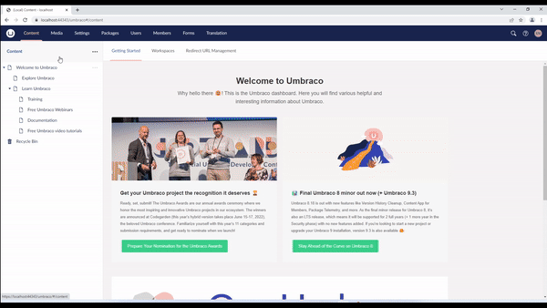

# Restoring Content

When you have content on your Cloud environment and clone down your project to your local machine, you need to restore the content. You will also need to use the restore option when setting up new Cloud environments.

The restore option can be used to always ensure you work with the latest content when delevoping new features.

## How to Restore Content

You can restore the content in the following ways:

1. [Restore when starting up the project locally](./#restore-when-starting-up-the-project-locally)
2. [Workspace Restore](./#workspace-restore)
3. [Tree Restore](./#tree-restore)
4. [Partial Restore](./#partial-restore)

### Restore when starting up the project locally

The first time you run your project locally you will have the option to restore your content and media before going to the Umbraco Backoffice.


This will restore **all** the content nodes and any media dependencies.


1. Run the website locally.
2. Click the green **Restore** button to restore all the content nodes and media files.
3. Wait till the process completes. This might take a while depending on the amount of content and media you have on your project.
4. Select **Open Umbraco** to go to the Backoffice.

All your content and media is now available in the Umbraco Backoffice.

### Workspace Restore

Use this option when setting up new Cloud environments. The Workspace restore option restores all the entities (content, media, forms, datasources, and prevalue sources from Umbraco Forms) of a workspace via the Backoffice.

1. Log in to the Umbraco Backoffice on the environment you want to restore the content and media.
2. Click **...** and select **Do something else** or Right-click the **Content** Tree in the Content section.
3. Choose **Workspace Restore**.
4. Select the environment from the **Restore this workspace from** dropdown.
5. Make sure that your environments have the [same schema](../cloud-to-cloud.md).
6. Click **Restore from <environment_name>** and wait till the process completes. This might take a while depending on the amount of content and media you have on your project.
7. Click **Okay** to complete the process once the restore is done.
8. Right-click the **Content** tree and choose **Reload** to see your content in the tree.


Workspace restore


### Tree Restore

The Tree restore option restores all the entities available for the selected tree in that section. It's available in the **Content**, **Media**, **Members**, **Forms** (root node of Forms, Datasources, and Prevalue sources), or **Translation** (Dictionary menu if configured) sections. Using Tree Restore, you can choose to restore only content. This will restore any media that’s referenced in that content, but it won’t attempt to restore the full media library.

1. Log in to the Umbraco Backoffice in the environment you want to restore the tree.
2. Click **...** and select **Do something else** or Right-click the **Content** Tree in the Content section.
3. Choose **Tree Restore**.
4. Select the environment from the **Restore this tree from** dropdown.
5. Make sure that your environments have the [same schema](../cloud-to-cloud.md).
6. Click **Restore from <environment_name>** and wait till the process completes. This might take a while depending on the amount of content and media you have on your project.
7. Click **Okay** to complete the process when the restore is done.
8. Right-click the **Content** tree and choose **Reload** to see your content in the tree.


Video example.


### [Partial Restore](partial-restore.md)

Using the Partial Restore option, you can restore single nodes from a tree (optionally with descendants) that you need to work with.
