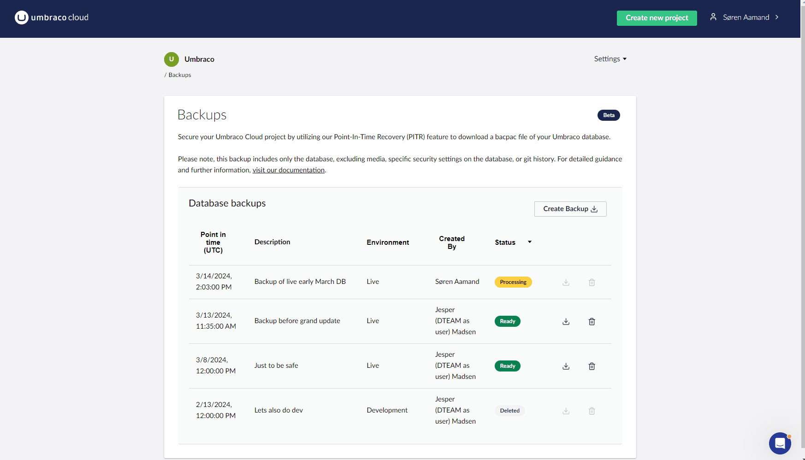

# March 2024

## Key Takeaways

* **Database Export** - Export your database smoothly with point-in-time recovery, ensuring your project's data is always safeguarded for when you need it most.

## Export Your Database Smoothly With Point-In-Time Recovery

With the introduction of the Point-In-Time Recovery (PITR) feature on the new "Backups" page, managing backups of your cloud projects database has never been more straightforward. This new feature empowers you with the flexibility to export backups of your Umbraco database directly from Azure on your terms. Perfect for those moments right before a significant update, during troubleshooting, or when you need to revert recent changes.

All previous backups are neatly organized for easy access. From this list, you can opt to download the .bacpac file or delete any backup. Accessing the new page requires admin permission on the cloud project.

Looking ahead, we're enhancing this feature to include the ability to import and swap database backups, which will add another layer of flexibility to your data management strategy. We're also planning to broaden the backup solution to encompass media files, aiming for a comprehensive approach that ensures every aspect of your project is securely backed up.

So next time you're gearing up for a big change, head over to the "Backups" page, and with just a few clicks, you can secure your project's data. Stay tuned for more updates and enhancements designed to make your experience even better.

You can read more about how to use the feature in the[ Backup documentation.](../databases/backups.md#backup-on-umbraco-cloud)
