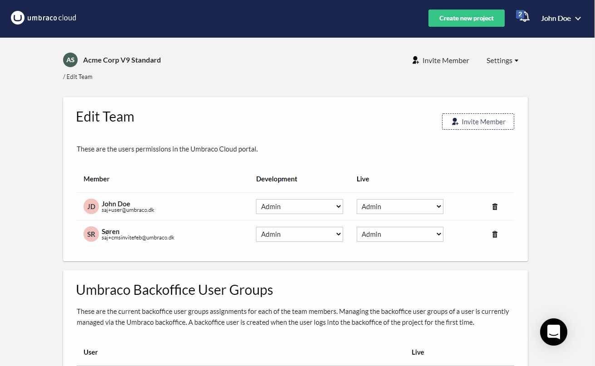

# June 2022

## Highlights video


Cloud highlights June 2022


## Runtime setting for .NET version

For Umbraco 9 projects and Umbraco 10 you can on the project subpage “Advanced” toggle the runtime settings between .NET 5 til .NET 6 on a per-environment basis.

Before updating, ensure the packages used are available in Umbraco 10 and that your custom code is valid with the .NET 6 Framework.

## New version of “Edit team” page

The “Edit team” page has received a facelift and is now based on the Umbraco UI Library web components. The new design has a modern look and gives you a sneak preview of the look and feel of the future Cloud Portal.

We will continuously improve the many other sections in the Portal and ensure that all pages will adopt the new design as shown on the reworked “Edit team” page.

## Improvements and fixes

During May and June, we provided small fixes and improvements to the Umbraco Cloud Portal. Here are some of the highlights:

* The much-used project subpage “Edit team” has been updated with a fresh new look using the Umbraco UI Library based on web components. Go have a look today!
* Custom hostnames for a few Umbraco 7 projects were not shown on the project subpage “Hostnames”.
* For Professional plans, the download of IIS logs required you to log into the Azure portal.
* Download of error logs at times opened in a new tab instead of starting downloading.
* A new project member could not instantly create a new cloud project.
