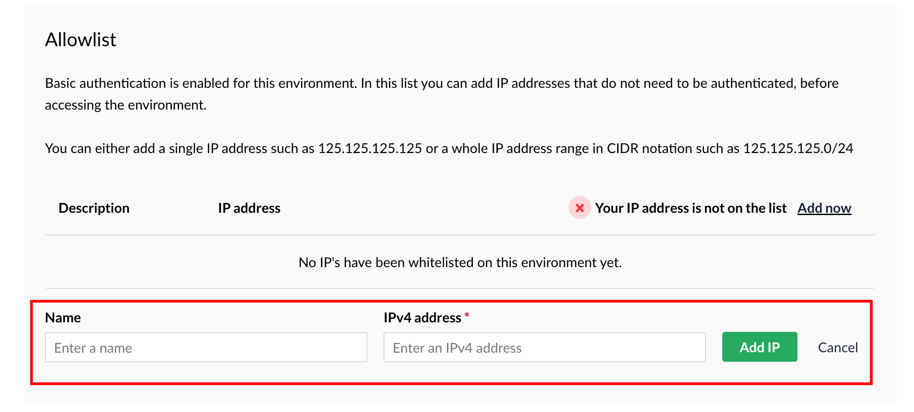

# Public Access


Public access is by default available for projects created after the 10th of January 2023.

The [Umbraco.Cloud.Cms.PublicAccess](https://www.nuget.org/packages/Umbraco.Cloud.Cms.PublicAccess) package can be installed to enable Public access for projects created before the 10th of January 2023.

The public access feature is available for all Umbraco Cloud projects on the standard plan or higher.


**Public Access** lets you deny access to your Umbraco Cloud project.

When enabled only team members on the project and users whose IPs have been allowed, can access the frontend of the project.

All environments on Umbraco Cloud projects can be protected by Public access. It requires you to enter your Cloud credentials in order to view the frontend.
    
## How to enable Basic Authentication and allow IPs

1. Go to **Public Access** in the **project settings** tab
2. Enable **Basic Authentication** on the project
   

3. Once enabled **Add IPs** for users that need access to the project
   

Once **Basic Authentication** has been enabled, users not on the project or with IPs not added to the allowlist will be prompted to log in.

