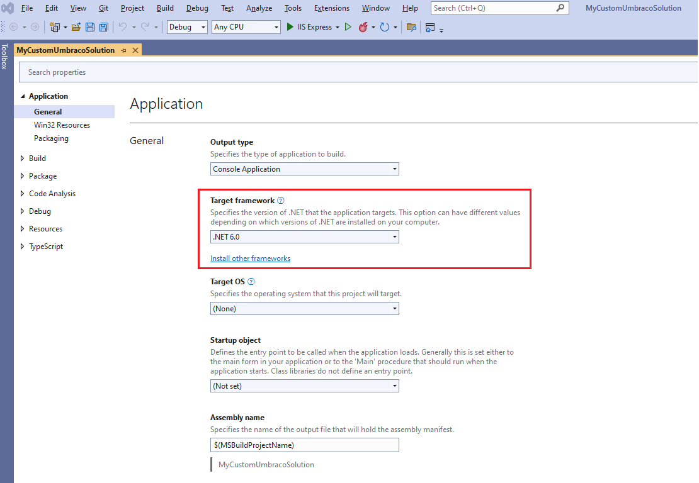

# Major Upgrades


**Are you using any custom packages or code on your Umbraco Cloud project?**

You need to ensure that any packages you use are available in the latest version of Umbraco. You also need to ensure that your custom code is valid with the new .NET Framework version.

**Breaking Changes**

Make sure you know the [Breaking changes](../../umbraco-cms/fundamentals/setup/upgrading/version-specific/) in the latest version of Umbraco CMS.


## Prerequisites

* Follow the **requirements** for [local development](../../umbraco-cms/fundamentals/setup/requirements.md#local-development).
* A Umbraco Cloud project running **the latest version of Umbraco**
* The **latest** .[NET version](https://dotnet.microsoft.com/en-us/download/visual-studio-sdks) is installed locally.
* **At least 2 environments** on your Cloud project.
* A backup of your project database.
  * Directly from your environment. See the [Database backups](../databases/backups.md) article,
  * Or clone down, restore the project, and backup the local database.

## Video Tutorial


This video guide you through the steps involved with upgrading your Cloud project to the next major CMS version.


## Step 1: Enable .NET

* Go to the project in the Umbraco Cloud portal.
* Navigate to **Settings** -> **Advanced**.
* Scroll down to the **Runtime Settings** section.
* **Ensure that the latest version of .NET is enabled** for each environment on your Cloud project.

<figure><figcaption>
Runtime settings
</figcaption></figure>

## Step 2: Clone down your environment

* Clone down the **Development** environment.
* Build and run the [project locally](../set-up/working-locally.md#running-the-site-locally).
* Log in to the backoffice.
* Restore content from your Cloud environment.

## Step 3: Upgrade the project locally using Visual Studio

* Open your project in Visual Studio - use the `csproj` file in the `/src/UmbracoProject` folder.
* Right-click your project solution in **Solution Explorer**.
* Select **Properties**.

<figure><figcaption></figcaption></figure>

* Select the same **.Net** **Target Framework** drop-down in the **General** section of the **Application** tab as on your Cloud project.

* Go to **Tools** > **NuGet Package Manager** > **Manage NuGet Packages for Solution...**.
* Navigate to the **Updates** tab.
* Checkmark all packages made **by Umbraco**:
  * Umbraco.Cms
  * Umbraco.Deploy.Cloud
  * Umbraco.Deploy.Contrib
  * Umbraco.Forms
  * Umbraco.Deploy.Forms
  * Umbraco.Cloud.Identity.Cms
* Checkmark the `Microsoft.Extensions.DependencyInjection.Abstractions` package if it appears in the list.
* Select **Update**.


If you have more projects in your solution or other packages, make sure that these are also updated to support the latest .NET framework.


## Step 4: Finishing the Upgrade

* Enable the [Unattended Upgrades](../../umbraco-cms/reference/configuration/unattendedsettings.md#upgrade-unattended) feature.
* Run the **project locally**.
* Log in to the Umbraco backoffice to **verify the upgrade** has happened.
* **Disable** the Unattended Upgrades feature.
* **Build and run** the project to verify everything works as expected.

Once the Umbraco project runs locally without any errors, the next step is to deploy and test on the Cloud Development environment.

* Push the changes to the **Development** environment. See the [Deploying from local to your environments](../deployment/local-to-cloud.md) article.
* Test **everything** in the **Development** environment.

We highly recommend that you go through everything in your Development environment. This can help you identify any potential errors after the upgrade, and ensure that you are not deploying any issues onto your Live environment.

## Step 5: Going live

Once everything works as expected in the development environment, you can push the upgrade to the live environment.

* [Working locally with Umbraco Cloud](../set-up/working-locally.md)
* [KUDU on Umbraco Cloud](../set-up/power-tools/)
