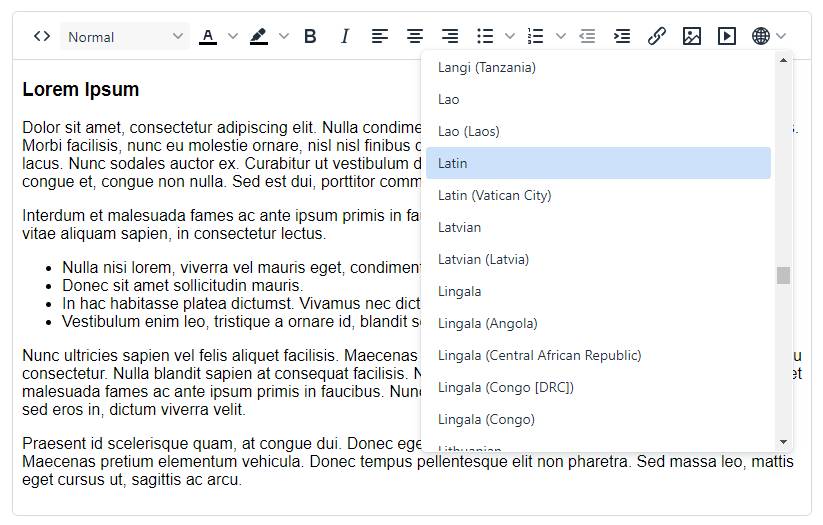

# February 2024
The following features are available to new sites created on or after February 12th. They will be rolled out to existing sites in the second quarter of 2024.

## Block Grid Editor
The Block Grid Editor from core Umbraco is now available in Heartcore. A modern alternative to the Grid Editor, this type is particularly useful for allowing content authors to build page-like structures.

See the [core CMS documentation](https://docs.umbraco.com/umbraco-cms/fundamentals/backoffice/property-editors/built-in-umbraco-property-editors/block-editor/block-grid-editor) for more information about how to get started with the Block Grid.


Unlike the core CMS, Heartcore does not yet support custom stylesheets or views to control block appearance in the backoffice. This is on the roadmap and support will be added later in the year.


## Backoffice Performance
A lot of work has been put into increasing the performance of the backoffice in this release. Content authors can expect to see a speed improvement across the board to most backoffice operations.

## Broken Link Warnings
Previously, deleting a content or media item that was linked to from another item may have resulted in broken links. Now, content authors will be warned when attempting to delete an item which other items are dependent upon. They are also informed *which* items linked to the deleted one, so that they can change those items if desired.

## Rich Text Enhancements
TinyMCE, the library underpinning the Rich Text Editor (RTE) in Heartcore has been upgraded. This includes a slew of bug fixes and a slick new appearance, but has also allowed us to include some frequently-requested enhancements. Both of these must be enabled in the Data Type before being available to content authors.

* **Text color** - You may now select foreground and background colors for text.
* **Language selection** - You may now choose a language for selected text from a dropdown menu. This will apply a `lang` attribute to the underlying markup. Browsers and screen readers that parse the markup will then be able to make smarter decisions about how to present that content to end-users.

## Notable Bug Fixes
In this release we have upgraded a lot of the technologies upon which Heartcore depends, including the core CMS. This means there is huge number of fixes to defective behaviors that we cannot hope to cover entirely here.

Instead, here is a brief list of fixes to some of the most highly-reported issues:
* Transferring content between environments should no longer fail if the content contains a URL picker that references another content item.
* In a content item with list view enabled, ordering children by the "Is Published" column should correctly sort items.
* The preview button should now correctly display for all content items that vary by culture.
* Language content management endpoints should now return a 400 Bad Request or 415 Unsupported Media type, instead of a generic 500 error.
* Sorting on an optional DateTime field using GraphQL should now return results after the first page.